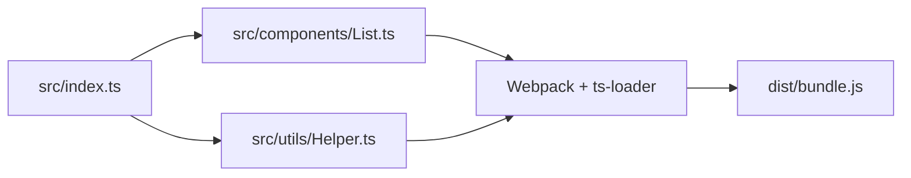

## Phần 1. JavaScript Fundamentals (ES6+)

### 1. Giới thiệu về JavaScript Fundamentals (ES6+)
*   **JavaScript (JS):** Là ngôn ngữ lập trình phía máy khách (client-side) phổ biến nhất trên thế giới, đóng vai trò cốt lõi trong phát triển ứng dụng Web.
*   **ES6 (ECMAScript 2015):** Là một bản cập nhật lớn mang tính bước ngoặt của JavaScript, giới thiệu hàng loạt cú pháp và tính năng hiện đại như: `let`, `const`, arrow functions (hàm mũi tên), class (lớp), modules (mô-đun), promise (đồng bộ/bất đồng bộ)... giúp việc viết mã trở nên ngắn gọn, minh bạch và an toàn hơn.

---

### 2. Biến và Kiểu dữ liệu (Variables and Data Types)

#### 2.1 Từ khóa khai báo biến: `var`, `let`, `const`
| Đặc tính | `var` | `let` | `const` |
| :--- | :--- | :--- | :--- |
| **Phạm vi (Scope)** | Function scope | Block scope `{...}` | Block scope `{...}` |
| **Gán lại giá trị** | Có thể gán lại | Có thể gán lại | **Không thể gán lại** |
| **Khai báo lại** | Có thể khai báo lại | Không thể khai báo lại | Không thể khai báo lại |

#### 2.2 Các kiểu dữ liệu cơ bản (Data types):
*   **String (Chuỗi):** Biểu diễn dữ liệu dạng chữ.
*   **Number (Số):** Biểu diễn số nguyên và số thực.
*   **Boolean:** Trạng thái đúng/sai (`true`/`false`).
*   **Null:** Đại diện cho một giá trị trống hoặc không tồn tại một cách cố ý.
*   **Undefined:** Giá trị mặc định của một biến đã khai báo nhưng chưa được khởi tạo giá trị.
*   **Object (Đối tượng):** Kiểu dữ liệu phức hợp dùng để lưu trữ các tập hợp dữ liệu dưới dạng cặp `key: value`.

**Ví dụ thực tế:**
```javascript
let name = "Alice"; // Biến let có thể gán lại giá trị sau này
const skills = ["JS", "HTML"]; // Khai báo mảng hằng số const, không thể gán lại tham chiếu mới
```

---

### 3. Toán tử và Biểu thức (Operators and Expressions)
*   **Toán tử số học (Arithmetic operators):**
    *   Cơ bản: `+` (cộng), `-` (trừ), `*` (nhân), `/` (chia), `%` (chia lấy dư).
    *   ES6 bổ sung: `**` (toán tử lũy thừa, ví dụ `2 ** 3 = 8`).
*   **Toán tử so sánh (Comparison):**
    *   `==` vs `===`: Toán tử so sánh tương đối `==` (chỉ so sánh giá trị sau khi ép kiểu tự động) và toán tử so sánh tuyệt đối `===` (so sánh cả giá trị và kiểu dữ liệu - **khuyên dùng**).
    *   `!=` vs `!==`: So sánh không bằng tương đối (`!=`) và so sánh không bằng tuyệt đối (`!==`).
*   **Toán tử logic (Logical):**
    *   `&&` (Phép VÀ logic - AND).
    *   `||` (Phép HOẶC logic - OR).
    *   `!` (Phép PHỦ ĐỊNH logic - NOT).

---

### 4. Cấu trúc điều khiển (Control Structures)
*   **Câu lệnh điều kiện (Conditional statements):** Sử dụng các cấu trúc `if`, `else if`, `else` hoặc cấu trúc chọn lựa `switch` để rẽ nhánh xử lý logic.
*   **Vòng lặp (Loops):**
    *   Vòng lặp cơ bản: `for`, `while`, `do...while`.
    *   Vòng lặp duyệt phần tử: 
        *   `for...of`: Dùng để lặp qua các phần tử của một Iterable Object (như Array, String, Map, Set...).
        *   `for...in`: Dùng để lặp qua các thuộc tính đếm được (enumerable properties) của một Object.

**Ví dụ thực tế:**
```javascript
let score = 95;

if (score >= 90) {
  console.log("A");
} else {
  console.log("B");
}
```

---

### 5. Hàm & Hàm mũi tên (Functions & Arrow Functions)
*   **Khai báo hàm thông thường (Function Declaration):** Có hỗ trợ hoisting (có thể gọi hàm trước khi khai báo).
    ```javascript
    function sum(a, b) {
      return a + b;
    }
    ```
*   **Biểu thức hàm (Function Expression):** Không hỗ trợ hoisting.
    ```javascript
    const sum = function(a, b) {
      return a + b;
    };
    ```
*   **Hàm mũi tên (Arrow Function):** Cú pháp ngắn gọn diper, không tự định nghĩa ngữ cảnh `this` riêng (lexical this scoping).
    *   Nếu hàm chỉ có 1 tham số, có thể bỏ dấu ngoặc đơn.
    *   Nếu hàm chỉ có 1 dòng return, có thể bỏ dấu ngoặc nhọn `{}` và từ khóa `return`.
*   **Hàm gọi lại (Callback):** Truyền hàm dưới dạng tham số vào hàm khác. Thường dùng duyệt mảng như `.forEach()`, `.map()`,...

**Ví dụ thực tế:**
```javascript
// Hàm mũi tên ngắn gọn nhận 1 đối số và tự động return chuỗi chào hỏi
const greet = name => `Hello ${name}`;

// Sử dụng callback map qua mảng để nhân đôi các phần tử
const doubled = [1, 2, 3].map(x => x * 2); // Kết quả: [2, 4, 6]
```

---

### 6. Đối tượng & Mảng (Objects & Arrays)
*   **Đối tượng (Object):** Lưu trữ thông tin dưới dạng thuộc tính và phương thức.
*   **Mảng (Array):** Cung cấp các phương thức tích hợp sẵn cực kỳ mạnh mẽ để thao tác dữ liệu:
    *   `.map()`: Biến đổi từng phần tử trong mảng và trả về mảng mới có cùng độ dài.
    *   `.filter()`: Lọc các phần tử thỏa mãn điều kiện và trả về mảng con mới.
    *   `.reduce()`: Tích lũy các phần tử mảng thành một giá trị duy nhất (số, chuỗi, đối tượng...).
    *   `.forEach()`: Duyệt qua từng phần tử để thực hiện hành động phụ (side effect), không trả về giá trị mới.

**Ví dụ thực tế:**
```javascript
// Khởi tạo một đối tượng Object
const person = { name: "John", age: 30 };

// Khởi tạo một mảng Array
const numbers = [1, 2, 3];

// Lọc các số lớn hơn 1
const filteredNumbers = numbers.filter(n => n > 1); // Kết quả: [2, 3]
```

---

### 7. Lớp trong ES6 (Classes in ES6)
ES6 giới thiệu cú pháp `class` như một lớp vỏ bọc cú pháp (syntactic sugar) cho mô hình kế thừa dạng nguyên mẫu (prototype-based inheritance) của JavaScript, giúp tiếp cận lập trình hướng đối tượng (OOP) trực quan hơn.
*   **`constructor`:** Hàm khởi tạo thuộc tính cho đối tượng khi dùng từ khóa `new`.
*   **Kế thừa và Phương thức:** Hỗ trợ cơ chế kế thừa thông qua từ khóa `extends` và lớp cha `super`.

**Ví dụ thực tế:**
```javascript
class Animal {
  constructor(name) {
    this.name = name;
  }

  speak() {
    console.log(`${this.name} makes a sound`);
  }
}

const dog = new Animal("Buddy");
dog.speak(); // Output: "Buddy makes a sound"
```

---

### 8. Mô-đun (Modules - Import / Export)
Mô-đun trong ES6 (ES Modules - ESM) giúp chia nhỏ mã nguồn thành các file riêng biệt để dễ quản lý và tái sử dụng.
*   **`export`:** Xuất biến, hàm, hoặc lớp từ một file để file khác có thể sử dụng.
*   **`import`:** Nhập các thành phần được xuất từ file khác vào file hiện tại.

**Ví dụ thực tế:**
```javascript
// file: math.js
export const add = (a, b) => a + b;

// file: app.js
import { add } from './math.js';
console.log(add(2, 3)); // Output: 5
```

---

### 9. Promises & Async/Await (Xử lý bất đồng bộ)
*   **Promise:** Đại diện cho kết quả của một tác vụ bất đồng bộ sẽ hoàn thành trong tương lai. Có 3 trạng thái: *Pending* (đang chờ), *Fulfilled* (thành công), và *Rejected* (thất bại).
*   **Async/Await:** Cú pháp hiện đại được xây dựng trên nền tảng Promise, giúp viết và đọc mã bất đồng bộ tự nhiên giống như mã đồng bộ thông thường.
    *   Từ khóa `async` khai báo một hàm bất đồng bộ luôn trả về một Promise.
    *   Từ khóa `await` (chỉ dùng được trong hàm `async`) giúp tạm dừng thực thi cho đến khi Promise được giải quyết (resolved).

**Ví dụ thực tế:**
```javascript
// Tạo một hàm giả lập bất đồng bộ lấy dữ liệu sau 1 giây
const fetchData = () => {
  return new Promise(resolve => {
    setTimeout(() => resolve("Done"), 1000);
  });
};

// Hàm async sử dụng await để chờ kết quả bất đồng bộ
async function load() {
  const data = await fetchData();
  console.log(data); // In ra "Done" sau 1 giây
}

load();
```

---

## Phần 2. JavaScript ES6+ Advance (JavaScript ES6+ nâng cao)

### 1. Classes & basic OOP (Lớp và Lập trình hướng đối tượng cơ bản)

#### 1.1 Khái niệm về Class và Instance:
*   **Class (Lớp):** Bản thiết kế tổng thể (blueprint) định nghĩa các thuộc tính (properties) và hành vi (behaviors) chung.
*   **Instance (Thực thể):** Đối tượng cụ thể (concrete object) được khởi tạo từ bản thiết kế của Class.
*   *Triết lý cốt lõi:* Khởi tạo định nghĩa một lần (**Create one**), tạo thực thể sử dụng nhiều lần (**Instantiate many times**).

```
+------------------------------------+
|               CLASS                |
|      (Bản thiết kế ngôi nhà)        |
+-----------------+------------------+
                  |
                  | new (Khởi tạo thực thể)
                  v
+-----------------+------------------+
|             INSTANCE               |
|      (Ngôi nhà thực tế xây ra)     |
+------------------------------------+
```

#### 1.2 Cú pháp cơ bản của Class (Basic syntax):
```javascript
class Animal {
  constructor(name, age) {
    this.name = name; // Thuộc tính (Property)
    this.age = age;   // Thuộc tính (Property)
  }

  eat() { // Phương thức (Method)
    console.log(`${this.name} is eating!`);
  }
}

// Khởi tạo một thực thể (Instance) từ lớp cha Animal
const myAnimal = new Animal("Lion", 5);
myAnimal.eat(); // Output: "Lion is eating!"
```

---

### 2. Kế thừa trong hướng đối tượng (Inheritance)
*   **Định nghĩa:** Là cơ chế cho phép một lớp mới (lớp con) kế thừa lại tất cả các thuộc tính và hành vi có sẵn từ một lớp đã tồn tại (lớp cha).
*   **Mục tiêu:** Tăng khả năng tái sử dụng mã nguồn và giữ code sạch đẹp, tuân thủ nguyên tắc **DRY (Don't Repeat Yourself)**.

$$\text{Animal} \ (\text{Act, Eat}) \xrightarrow{\text{Inherit}} \text{Mammal} \ (\text{Warm blooded, Hair}) \xrightarrow{\text{Inherit}} \begin{cases} \text{Cat (Good eyesight, Run)} \\ \text{Rabbit (Good hearing, Run)} \end{cases}$$

#### 2.1 Các từ khóa cốt lõi:
*   **`extends`:** Chỉ định lớp con kế thừa lại từ lớp cha.
*   **`super()`:** Hàm gọi lại constructor của lớp cha để khởi tạo các thuộc tính cha trước khi thêm các thuộc tính riêng của lớp con.

#### 2.2 Cú pháp kế thừa:
```javascript
class Pet extends Animal {
  constructor(name, age, owner) {
    super(name, age); // Gọi constructor của lớp cha Animal
    this.owner = owner; // Thuộc tính mới khai báo riêng của lớp con Pet
  }

  play() { // Phương thức mới của riêng lớp Pet
    console.log(`${this.name} is playing!`);
  }
}
```

---

### 3. Mô-đun trong phát triển phần mềm (Modules)
*   **Tại sao lại cần Modules?**
    *   *Trước khi dùng modules (BEFORE):* Mã nguồn chồng chất, lộn xộn giống như một căn phòng bừa bộn không được dọn dẹp, gây khó khăn cho việc quản lý và phát hiện lỗi.
    *   *Sau khi dùng modules (AFTER):* Mã nguồn được chia nhỏ và đóng gói cẩn thận vào từng ngăn hộp lưu trữ logic riêng biệt, giúp dự án ngăn nắp, dễ đọc và dễ bảo trì.
    *   *Giải pháp:* Modules giúp giải quyết triệt để bài toán **"Spaghetti Code"** (mọi thứ dồn hết vào một file lớn duy nhất) bằng cách chia nhỏ code thành các file nhỏ độc lập, có thể tái sử dụng.
*   **Lợi ích của Modules:**
    *   **Maintainability (Dễ bảo trì):** Sửa lỗi hay nâng cấp tính năng cục bộ trong một mô-đun mà không ảnh hưởng tới luồng chạy chính.
    *   **Namespacing (Quản lý không gian tên):** Tránh xung đột tên biến/tên hàm toàn cục giữa các phần khác nhau của hệ thống.
    *   **Reusability (Tái sử dụng):** Một mô-đun viết ra có thể được import sử dụng ở nhiều nơi khác nhau dễ dàng.

#### 3.1 Hai cơ chế Xuất/Nhập Modules: Named Export và Default Export
React và ES6 hỗ trợ 2 cách chính để xuất dữ liệu từ một Module:

| Đặc tính | Named Export (Xuất có tên) | Default Export (Xuất mặc định) |
| :--- | :--- | :--- |
| **Số lượng trong 1 file** | Không giới hạn (Multiple per file) | **Duy nhất một** (Only ONE per file) |
| **Cú pháp Xuất (Export)** | `export const name = ...` | `export default ...` |
| **Cú pháp Nhập (Import)** | `import { name } from '...'` (Phải khớp chính xác tên) | `import name from '...'` (Tùy chọn tên linh hoạt theo ý muốn) |

#### 3.2 Ví dụ minh họa kết hợp cả hai cơ chế:
```javascript
// file: mathUtils.js
export const PI = 3.14; // Named Export
export const e = 2.71;   // Named Export

export default function add(a, b) { // Default Export
  return a + b;
}

// file: app.js
import add, { PI, e } from './mathUtils'; // Nhập đồng thời cả Default và Named

console.log(add(PI, e)); // Output: 5.85
```

---

### 4. Promises và Async/Await (Xử lý bất đồng bộ chuyên sâu)

#### 4.1 So sánh cơ chế Đồng bộ (Synchronous) và Bất đồng bộ (Asynchronous):

```
Đồng bộ (Synchronous):
Process A ----------> Gọi Process B ---------> [Đợi phản hồi (UI bị đơ)] ---------> Nhận kết quả B
                                                                                   (Tiếp tục chạy)

Bất đồng bộ (Asynchronous):
Process A ----------> Gọi Process B ---------> [Vẫn tiếp tục làm việc khác] -------> Nhận kết quả B qua Event Loop
```

*   **Đồng bộ (Synchronous):** 
    *   JavaScript thực thi mã nguồn trực tiếp trên luồng giao diện chính (**Main UI Thread**).
    *   JS chỉ có duy nhất **MỘT Call Stack** (luồng đơn - single-threaded), nên nó chỉ làm duy nhất một việc tại một thời điểm, chạy tuần tự từng dòng code từ trên xuống dưới.
    *   *Rủi ro:* Nếu có một tác vụ tốn quá nhiều thời gian xử lý (như đọc file nặng, tính toán sâu), **toàn bộ giao diện người dùng (UI) sẽ bị đóng băng (frozen)** cho đến khi tác vụ đó hoàn thành.
*   **Bất đồng bộ (Asynchronous):**
    *   Ủy thác (delegate) các tác vụ nặng hoặc chậm chạp (như gọi API, hẹn giờ `setTimeout`) cho trình duyệt (Web APIs) hoặc hệ thống xử lý bên ngoài luồng chính.
    *   Luồng giao diện UI chính vẫn tiếp tục chạy mượt mà, không bị chặn hay gián đoạn.
    *   Khi tác vụ bất đồng bộ hoàn thành, kết quả của nó sẽ được đưa vào hàng đợi và gửi trả về luồng chính thông qua cơ chế **Event Loop** khi Call Stack rỗng.

*   Khi tác vụ bất đồng bộ hoàn thành, kết quả của nó sẽ được đưa vào hàng đợi và gửi trả về luồng chính thông qua cơ chế **Event Loop** khi Call Stack rỗng.

#### 4.2 Định nghĩa và 3 trạng thái của một Promise:
**Promise** là một đối tượng đại diện cho kết quả hoàn thành (hoặc thất bại) trong tương lai của một tác vụ bất đồng bộ.

Một Promise luôn có 3 trạng thái chính:
*   **Pending (Đang chờ):** Tác vụ đang được thực thi, chưa có kết quả (In progress...).
*   **Fulfilled (Thành công):** Tác vụ hoàn thành xuất sắc, trả về dữ liệu thành công. Sẽ kích hoạt hàm `.then(onFulfillment)`.
*   **Rejected (Thất bại):** Tác vụ thất bại do lỗi phần cứng, mạng,... Sẽ kích hoạt hàm `.catch(onRejection)`.

$$\text{Promise (Pending)} \begin{cases} \xrightarrow{\text{fulfill}} \text{.then(onFulfillment)} \longrightarrow \text{New Pending Promise...} \\ \xrightarrow{\text{reject}} \text{.catch(onRejection)} \longrightarrow \text{New Pending Promise...} \end{cases}$$

#### 4.3 Khởi tạo và Sử dụng Promise:

**Bước 1: Khai báo (Tạo) Promise:**
```javascript
const apiCall = () => {
  return new Promise((resolve, reject) => {
    console.log("Promise State: PENDING...");
    
    // Giả lập cuộc gọi API bất đồng bộ sau 2 giây
    setTimeout(() => {
      const success = Math.random() > 0.5; // Ngẫu nhiên thành công hoặc thất bại
      
      if (success) {
        resolve("Data loaded successfully!"); // Trả dữ liệu thành công
      } else {
        reject("Network error!"); // Báo lỗi
      }
    }, 2000);
  });
};
```

**Bước 2: Tiêu thụ (Sử dụng) Promise:**
```javascript
apiCall()
  .then((result) => {
    console.log("Promise State: FULFILLED");
    console.log("Result:", result);
  })
  .catch((error) => {
    console.log("Promise State: REJECTED");
    console.log("Error:", error);
  })
  .finally(() => {
    console.log("Promise finished (either success or fail)"); // Luôn luôn chạy khi kết thúc
  });
```

---

### 5. Cú pháp Async / Await hiện đại

#### 5.1 Quy tắc sử dụng Async/Await (Rules):
Cú pháp **Async/Await** giúp bạn viết mã nguồn bất đồng bộ trông giống như mã đồng bộ thông thường, giúp cấu trúc code phẳng hơn và dễ đọc hơn.
*   **`async`:** Đặt ở phía trước khai báo hàm (Function). Hàm này sẽ luôn tự động trả về một Promise.
*   **`await`:** Đặt ở phía trước lệnh gọi Promise. Nó sẽ tạm dừng việc thực thi tiếp theo của hàm cho đến khi Promise trả về kết quả thành công/thất bại (nhưng không chặn luồng chính UI của trình duyệt).
*   **Xử lý lỗi:** Bắt buộc phải bọc cấu trúc `await` trong khối lệnh **`try...catch`** để quản lý các lỗi phát sinh.

#### 5.2 So sánh Promise Chain (Chuỗi Promise) và Async/Await:

Chúng ta cùng so sánh việc thực hiện 3 tác vụ tuần tự liên tiếp: Đăng nhập $\rightarrow$ Lấy thông tin cá nhân $\rightarrow$ Lấy danh sách đơn hàng.

##### Cách 1: Sử dụng chuỗi Promise Chain truyền thống
```javascript
login()
  .then((result) => {
    console.log(result);
    return getUserProfile(); // Trả tiếp một Promise khác
  })
  .then((profile) => {
    console.log(profile);
    return getOrders(); // Trả tiếp một Promise khác
  })
  .then((orders) => {
    console.log(orders);
  })
  .catch((error) => {
    console.log("Error:", error);
  });
```

##### Cách 2: Sử dụng cú pháp Async / Await tối giản (Khuyên dùng)
```javascript
async function loadUserData() {
  try {
    const loginResult = await login();
    console.log(loginResult);

    const profile = await getUserProfile();
    console.log(profile);

    const orders = await getOrders();
    console.log(orders);
  } catch (error) {
    console.log("Error:", error);
  }
}

loadUserData();
```

---

## Phần 3. Understanding Static Typing (Tìm hiểu về Kiểu dữ liệu tĩnh)

### 1. Định nghĩa và Tầm quan trọng của Static Typing
Kiểu dữ liệu tĩnh (Static Typing) là một khái niệm nền tảng trong phát triển phần mềm hiện đại, đóng vai trò như chiếc móng vững chắc giúp xây dựng các hệ thống phần mềm mạnh mẽ, tin cậy và dễ bảo trì.

---

### 2. Các lợi ích cốt lõi của Static Typing (Core Benefits)

#### 2.1 Lợi ích 1: Early Error Detection (Phát hiện lỗi sớm trước khi chạy)
*   **Bắt lỗi trước thời gian chạy (Pre-Runtime Bug Catch):** Quá trình biên dịch (Compile-time checks) chủ động quét và xác định chính xác các lỗi kiểu dữ liệu phổ biến như `TypeError` và `AttributeError` trước khi code được thực thi.
*   **Giảm thiểu thời gian gỡ lỗi (Reduced Debugging Time):** Dịch chuyển việc phát hiện lỗi về bên trái ("shift left") trong chu kỳ phát triển phần mềm, giúp giảm nỗ lực gỡ lỗi lên tới **30%**.
*   **An toàn khi triển khai (Deployment Safety):** Ngăn chặn các lỗi nghiêm trọng xuất hiện ở hệ thống Production, tránh tình trạng ứng dụng bị sập bất ngờ khi người dùng đang sử dụng.
*   *Ví dụ:* Bộ biên dịch sẽ lập tức báo lỗi type mismatch khi cố gắng cộng một chuỗi (`String`) với một số nguyên (`int`), tiết kiệm thời gian quý giá cho lập trình viên.

#### 2.2 Lợi ích 2: Enhanced Code Readability & Maintainability (Tăng độ đọc hiểu và bảo trì code)
*   **Mã nguồn tự ghi tài liệu (Self-Documenting Code):** Việc khai báo rõ ràng kiểu dữ liệu của các biến/props hoạt động như một tài liệu hướng dẫn tích hợp sẵn bên trong code.
*   **Cải thiện làm việc nhóm (Improved Team Collaboration):** Giúp các nhóm từ 5 lập trình viên trở lên dễ dàng hiểu và làm việc chung trên cùng một kho lưu trữ mã nguồn lớn.
*   **Hỗ trợ Onboarding dễ dàng (Simplified Onboarding):** Giúp thành viên mới gia nhập đội ngũ nhanh chóng nắm bắt cấu trúc code và luồng dữ liệu của dự án.
*   **Refactor code an sau (Safer Refactoring):** Hỗ trợ chỉnh sửa cấu trúc mã nguồn một cách tự tin, giảm thiểu tối đa rủi ro phát sinh tác dụng phụ (side effects) ngoài mong muốn.

#### 2.3 Lợi ích 3: Superior IDE Support & Developer Experience (Tăng trải nghiệm lập trình trên IDE)
*   **Gợi ý code thông minh (Intelligent Autocompletion):** Tự động gợi ý hoàn thành mã lệnh thông minh, giúp giảm thiểu lỗi cú pháp và tăng tốc độ viết code lên đến **20%**.
*   **Phản hồi thời gian thực (Real-time Feedback):** Bôi đỏ và đưa ra cảnh báo lỗi trực tiếp ngay trên màn hình biên tập code của IDE khi bạn vừa gõ sai.
*   **Công cụ tái cấu trúc mạnh mẽ (Robust Refactoring Tools):** Cho phép đổi tên các biến/lớp (`Rename Symbol`) trên toàn bộ dự án một cách chính xác tuyệt đối chỉ với 1 click.
*   **Điều hướng code tối ưu (Enhanced Code Navigation):** Giúp bạn di chuyển nhanh chóng trong dự án (ví dụ sử dụng lệnh *"Go to Definition"* để nhảy tới nơi khai báo hàm/biến gốc).

---

### 3. So sánh Kiểu dữ liệu Tĩnh (Static Typing) và Động (Dynamic Typing)

| Tiêu chí so sánh | Static Typing (Kiểu tĩnh) | Dynamic Typing (Kiểu động) |
| :--- | :--- | :--- |
| **Cơ chế kiểm tra kiểu** | Kiểm tra kiểu dữ liệu trong **quá trình biên dịch** (before the program runs). | Kiểm tra kiểu dữ liệu trong **quá trình chạy ứng dụng** (while the program runs). |
| **Tính nghiêm ngặt** | Bắt buộc khai báo kiểu dữ liệu chặt chẽ, phát hiện lỗi rất sớm. | Linh hoạt, mềm dẻo, viết code thử nghiệm nhanh. |
| **Ví dụ ngôn ngữ** | Java, C#, C++, Go, **TypeScript** | Python, **JavaScript**, Ruby, PHP |

---

### 4. Thực tế áp dụng hệ thống kiểu dữ liệu (Practice Examples)

#### 4.1 Ví dụ về Hệ thống Kiểu tĩnh (Static Typing in Practice):
*   **Java:** Yêu cầu khai báo kiểu dữ liệu rõ ràng cho tất cả các biến và tham số của hàm. Bộ biên dịch (compiler) sẽ kiểm tra tính tương thích của kiểu dữ liệu trong quá trình build dự án.
    ```java
    String name = "Alice";
    int age = 30;
    ```
*   **C#:** Áp dụng kiểm tra kiểu dữ liệu nghiêm ngặt trong các cấu trúc hướng đối tượng, hỗ trợ xây dựng phần mềm mạnh mẽ, ổn định.
    ```csharp
    List<string> names = new List<string>();
    ```
*   **TypeScript:** Bổ sung thêm một lớp kiểm tra kiểu dữ liệu tĩnh tùy chọn (optional static typing layer) lên trên JavaScript, làm cho nó trở nên lý tưởng để xây dựng các ứng dụng web lớn và phức tạp.
    ```typescript
    function greet(name: string): string {
      return `Hello, ${name}`;
    }
    ```

#### 4.2 Ví dụ về Hệ thống Kiểu động (Dynamic Typing in Practice):
*   **Python:** Kiểu dữ liệu của biến được xác định tại thời điểm gán giá trị và có thể thay đổi động trong suốt quá trình chạy. Các lỗi như `AttributeError` khi gọi phương thức không tồn tại sẽ chỉ xuất hiện khi ứng dụng đang chạy (runtime).
    ```python
    name = "Bob"
    age = 25
    ```
*   **JavaScript:** Cung cấp sự linh hoạt cực cao, cho phép một biến chứa nhiều kiểu dữ liệu khác nhau ở các thời điểm khác nhau. Tuy nhiên, sự linh hoạt này có thể dẫn đến các lỗi kiểu dữ liệu nghiêm trọng khó phát hiện ở runtime.
    ```javascript
    let value = "hello";
    value = 123;
    ```
*   **Ruby:** Nổi tiếng với triết lý **"Duck Typing"** (Kiểu con vịt): *"Nếu nó đi như một con vịt và kêu như một con vịt, thì nó chính là một con vịt"*. Có nghĩa là tính phù hợp của đối tượng được quyết định bởi các phương thức mà nó sở hữu, chứ không phải do định nghĩa kiểu tường minh của nó.
    ```ruby
    def add(a, b)
      a + b
    end
    ```

---

### 5. Kết luận: Lựa chọn Hệ thống Kiểu dữ liệu phù hợp (Conclusion)
Việc lựa chọn giữa kiểu dữ liệu tĩnh hay động phụ thuộc trực tiếp vào nhu cầu cụ thể của từng dự án:

*   **Ưu thế của Kiểu dữ liệu tĩnh (Static Typing):** Phát hiện lỗi sớm từ trứng nước, tăng khả năng bảo trì và đọc hiểu mã nguồn, hỗ trợ công cụ lập trình (IDE) vượt trội. Cực kỳ phù hợp cho các **dự án lớn, hệ thống phức tạp và phát triển lâu dài**.
*   **Ưu thế của Kiểu dữ liệu động (Dynamic Typing):** Cung cấp sự linh hoạt cao hơn, viết code nhanh hơn trong giai đoạn đầu, lý tưởng cho việc **làm thử nghiệm (prototyping) và các dự án quy mô nhỏ**.
*   **Các yếu tố cân nhắc chính:** Quy mô dự án, số lượng thành viên trong nhóm phát triển, và yêu cầu bảo trì dài hạn sẽ quyết định sự lựa chọn của bạn.
*   **Giải pháp lai (Hybrid Approach):** Các giải pháp như **TypeScript** mang lại sự kết hợp hoàn hảo của cả hai thế giới: tận dụng tối đa lợi ích của kiểu tĩnh cho các ứng dụng web phức tạp nhưng vẫn giữ được sự linh hoạt, mềm dẻo vốn có của JavaScript.

---

## Phần 4. TypeScript Introduction (Giới thiệu về TypeScript)

### 1. Sơ lược Lịch sử phát triển và Mối quan hệ với JavaScript
*   **Lịch sử phát triển:**
    *   Năm 1995: JavaScript được ra mắt bởi Brendan Eich.
    *   Năm 1996: Tiêu chuẩn hóa ECMAScript.
    *   Năm 2006: Thư viện jQuery ra đời giải quyết vấn đề tương thích trình duyệt.
    *   Năm 2009: NodeJS được Ryan Dahl giới thiệu, mang JS lên Server.
    *   Năm 2012 - 2013: **TypeScript** chính thức được công bố bởi Microsoft, đứng đầu là kiến trúc sư trưởng **Anders Hejlsberg** (cha đẻ của ngôn ngữ C# và Delphi).
*   **Mối quan hệ Superset (Tập mẹ):**
    *   TypeScript không phải là một ngôn ngữ viết lại hoàn toàn mới, mà nó là một **tập mẹ (Superset)** của JavaScript.
    *   *Triết lý:* $\text{JavaScript} \subset \text{TypeScript}$. Bất kỳ đoạn mã JavaScript hợp lệ nào cũng đều là mã TypeScript hợp lệ. TypeScript chỉ bao bọc bên ngoài và bổ sung thêm các tính năng kiểm soát kiểu dữ liệu mạnh mẽ.

---

### 2. Định nghĩa TypeScript là gì?
TypeScript là một ngôn ngữ lập trình mã nguồn mở được phát triển và duy trì bởi Microsoft với các đặc trưng nổi bật:
*   Là **Superset** (tập cha) của JavaScript.
*   Cung cấp tính năng kiểm tra kiểu dữ liệu tĩnh (**Static typing**).
*   Hỗ trợ lập trình hướng đối tượng dựa trên lớp vững chắc (**Class-based OOP**).
*   Mã nguồn mở (Open source).
*   Được biên dịch ngược về JavaScript tiêu chuẩn (ES5 hoặc ES6) bởi trình biên dịch TypeScript (tsc) để chạy được trên bất kỳ trình duyệt hay môi trường NodeJS nào.

---

### 3. Nguyên lý hoạt động của TypeScript (How it works)
Trình duyệt web và Node.js không thể trực tiếp hiểu và chạy file `.ts`. Vì vậy:

$$\text{Mã nguồn TypeScript (.ts)} \xrightarrow{\text{Trình biên dịch (tsc)}} \text{Mã nguồn JavaScript (.js)}$$

1.  Lập trình viên viết mã nguồn trong các file định dạng `.ts`.
2.  **TypeScript Compiler (tsc)** sẽ quét qua các file này, thực hiện kiểm tra kiểm lỗi kiểu dữ liệu nghiêm ngặt.
3.  Nếu không có lỗi, trình biên dịch sẽ chuyển đổi (transpile/compile) mã TypeScript thành mã JavaScript thông thường (`.js`) tương thích với các phiên bản ES5, ES6+ tùy cấu hình.
4.  Mã nguồn JavaScript đầu ra này sẽ được chạy bình thường trên browser hoặc server.

---

### 4. Tại sao TypeScript vượt trội hơn JavaScript? (Why TypeScript is better?)
*   **Hỗ trợ toàn bộ tính năng JS hiện đại nhất:** Tương thích hoàn toàn với tất cả cú pháp mới nhất của ECMAScript (bao gồm ES6, ES7...).
*   **Hỗ trợ hoàn hảo mọi thư viện JS:** Có thể tích hợp dễ dàng với tất cả các thư viện và tài liệu API của JavaScript hiện có như jQuery, BootstrapJS, React, Vue,... thông qua các file định nghĩa kiểu dữ liệu (`.d.ts`).
*   **Tái cấu trúc mã nguồn (Refactoring) cực kỳ dễ dàng:** Nhờ hệ thống kiểm tra kiểu tĩnh, việc chỉnh sửa hoặc tối ưu hóa code lớn trở nên an toàn hơn nhiều, đồng thời nâng cao kỹ năng lập trình hướng đối tượng (OOP).
*   **Dễ học và tiếp cận:** Lập trình viên đã biết JavaScript có thể học TypeScript rất nhanh nhờ cú pháp tương đồng.
*   **Phát triển ứng dụng lớn (Scale):** Cực kỳ phù hợp để xây dựng các ứng dụng lớn một cách nhanh chóng, dễ bảo trì, dễ mở rộng và có khả năng tái sử dụng cao.

---

### 5. So sánh trực tiếp: TypeScript vs JavaScript
Dưới đây là bảng so sánh làm rõ sự khác biệt bản chất giữa hai ngôn ngữ:

| Đặc tính so sánh | TypeScript (TS) | JavaScript (JS) |
| :--- | :--- | :--- |
| **Kiểm tra kiểu dữ liệu** | Kiểm soát kiểu dữ liệu mạnh mẽ (**Strong typing**): Cả tĩnh (Static) và động (Dynamic). | Chỉ hoạt động với hệ thống kiểu động (**Dynamic typing**). |
| **Nhà phát triển & Ra mắt** | Được phát triển bởi Microsoft (Anders Hejlsberg) vào năm 2012. | Được phát triển ban đầu bởi Netscape vào năm 1995. |
| **Đuôi mở rộng của file** | `.ts` | `.js` |
| **Khả năng chạy trên trình duyệt** | **Không thể chạy trực tiếp** trên trình duyệt (cần biên dịch sang JS). | **Chạy trực tiếp** trên tất cả các trình duyệt web. |
| **Thời điểm phát hiện lỗi** | Phát hiện và sửa lỗi ngay tại **thời điểm biên dịch** (Compile-time). | Lỗi chỉ được phát hiện khi ứng dụng **đang chạy** (Runtime). |
| **Hỗ trợ OOP nâng cao** | Hỗ trợ lập trình hướng đối tượng đầy đủ (Lớp, Interface, Kế thừa, Generics...). | Bản chất là ngôn ngữ kịch bản (Scripting), lập trình hướng đối tượng dựa trên Prototype. |
| **Cài đặt & Môi trường** | Cần cài đặt trình biên dịch thông qua công cụ quản lý thư viện **npm**. | Tích hợp sẵn trong trình duyệt, không cần cài đặt thêm trình biên dịch. |

---

### 6. Lựa chọn Môi trường phát triển tích hợp (IDE) cho TypeScript
Để lập trình TypeScript hiệu quả và tận dụng tối đa thế mạnh gợi ý code, bạn nên sử dụng các IDE hỗ trợ tốt sau:
*   **Visual Studio Family:**
    *   **Visual Studio Code (VS Code):** Lựa chọn phổ biến nhất, nhẹ, miễn phí và hỗ trợ cực tốt cho TypeScript.
    *   Visual Studio 2017 / 2019.
*   **Các trình soạn thảo & IDE khác:**
    *   **WebStorm:** IDE chuyên nghiệp, hỗ trợ TypeScript vượt trội từ hãng JetBrains.
    *   Sublime Text, Atom, Eclipse, Emacs.
    *   **Vim:** Dành cho lập trình viên ưa thích làm việc trên terminal.

---

### 7. Hướng dẫn cài đặt và thiết lập Môi trường

#### 7.1 Bước 1: Cài đặt Node.js
1.  Truy cập vào trang chủ Node.js: [https://nodejs.org/en/download/](https://nodejs.org/en/download/)
2.  Tải về phiên bản **LTS (Long Term Support)** - Phiên bản ổn định được khuyến nghị cho hầu hết người dùng.
3.  Chọn bộ cài đặt phù hợp với hệ điều hành của bạn (Windows Installer `.msi`, macOS Installer `.pkg`, hoặc Linux Binary).
4.  Tiến hành cài đặt theo hướng dẫn mặc định của phần mềm.

#### 7.2 Bước 2: Cài đặt TypeScript Compiler toàn cục
Sau khi cài đặt xong Node.js, bạn mở Terminal/Command Prompt lên và chạy lệnh sau để cài đặt trình biên dịch TypeScript thông qua npm:

```bash
npm install -g typescript
```

Lệnh này giúp bạn có thể sử dụng lệnh biên dịch `tsc` ở bất kỳ thư mục nào trên hệ thống máy tính.

---

### 8. Các lệnh kiểm tra phiên bản (Verify versions)
Sau khi hoàn tất cài đặt, bạn có thể thực hiện kiểm tra phiên bản của các công cụ bằng các dòng lệnh tương ứng:

*   **Kiểm tra phiên bản Node.js:**
    ```bash
    node -v
    # hoặc
    node --version
    ```
*   **Kiểm tra phiên bản công cụ quản lý thư viện npm:**
    ```bash
    npm -v
    # hoặc
    npm --version
    ```
*   **Kiểm tra phiên bản trình biên dịch TypeScript (tsc):**
    ```bash
    tsc -v
    # hoặc
    tsc --version
    ```

> [!NOTE]
> Bạn có thể tìm hiểu thêm các tài liệu chính thức, hướng dẫn và công cụ trực tuyến (Playground) của TypeScript tại địa chỉ trang chủ: [https://www.typescriptlang.org](https://www.typescriptlang.org)

---

### 9. Biên dịch thử nghiệm file TypeScript đầu tiên (.ts -> .js)
Để biên dịch thủ công một file nguồn TypeScript sang JavaScript thông thường:

```bash
tsc helloworld.ts
```

*   **`tsc`:** Gọi trình biên dịch TypeScript (TypeScript compiler).
*   **`helloworld.ts`:** Tên file chứa mã nguồn TypeScript cần được biên dịch.
*   **Kết quả đầu ra:** Trình biên dịch sẽ tạo ra một file mới có tên là `helloworld.js` nằm cùng thư mục chứa mã JavaScript tương ứng để sẵn sàng chạy trên trình duyệt hoặc Node.js.

---

### 10. Luồng làm việc thực tế với File TypeScript (.ts)
Khi phát triển ứng dụng, luồng viết mã, biên dịch và chạy diễn ra như sau:

1.  **Viết mã nguồn:** Tạo file `HelloWorld.ts` trong IDE (ví dụ: VS Code) với nội dung:
    ```typescript
    console.log("Hello World");
    ```
2.  **Biên dịch sang JS:** Mở terminal tại thư mục dự án và chạy:
    ```bash
    tsc HelloWorld.ts
    ```
3.  **Thực thi chương trình:** Chạy file JS vừa sinh ra bằng Node.js:
    ```bash
    node HelloWorld.js
    # Kết quả in ra màn hình: Hello World
    ```

---

### 11. Cấu trúc một Dự án TypeScript Đơn giản (Simple Project Structure)
Một dự án Web sử dụng TypeScript cơ bản thường bao gồm các file sau:
*   `app.ts`: File chứa mã nguồn TypeScript do bạn viết.
*   `tsconfig.json`: File cấu hình cho trình biên dịch TypeScript.
*   `app.js`: File JavaScript được tự động sinh ra sau khi biên dịch `app.ts`.
*   `index.html`: File HTML hiển thị giao diện Web và nhúng file script.

```
SIMPLEPROJECT/
├── app.ts          (TypeScript nguồn)
├── app.js          (JavaScript biên dịch ra)
├── tsconfig.json   (File cấu hình compiler)
└── index.html      (Trang web hiển thị)
```

---

### 12. So sánh mã nguồn trước và sau khi biên dịch
Chúng ta có thể thấy rõ sự khác biệt của hệ thống kiểu dữ liệu tĩnh trong TypeScript và JavaScript đầu ra tương ứng:

*   **Mã nguồn TypeScript (`app.ts`):**
    ```typescript
    let str: string = "Welcome to this course";
    console.log(str);
    ```
*   **Mã JavaScript sau khi biên dịch (`app.js`):**
    ```javascript
    var str = "Welcome to this course";
    console.log(str);
    ```

> [!TIP]
> Bạn có thể biên dịch bằng cách chỉ định đường dẫn rõ ràng: `tsc app.ts` hoặc `tsc ./app.ts`.

---

### 13. File cấu hình `tsconfig.json`
`tsconfig.json` là file cấu hình quan trọng nhất của một dự án TypeScript, chỉ thị cho trình biên dịch (`tsc`) cách hoạt động và phiên bản JavaScript đầu ra mà bạn mong muốn.

**Ví dụ cấu hình cơ bản:**
```json
{
  "compilerOptions": {
    "target": "es5"
  }
}
```

*   **`compilerOptions`:** Tập hợp các tùy chọn cấu hình cho trình biên dịch.
*   **`target`:** Xác định phiên bản chuẩn của ECMAScript đầu ra sau khi biên dịch (như `ES3`, `ES5`, `ES6`...). Cấu hình `"target": "es5"` giúp mã nguồn chạy ổn định trên các trình duyệt cũ hơn vốn không hỗ trợ các tính năng hiện đại của ES6+.

---

### 14. Cách nhúng mã vào trang Web (`index.html`)
Do các trình duyệt Web hiện nay chỉ có thể đọc hiểu và thực thi mã JavaScript, bạn **phải nhúng file `.js` đã biên dịch**, hoàn toàn không nhúng file `.ts` trực tiếp.

**Ví dụ trang `index.html`:**
```html
<!DOCTYPE html>
<html>
  <head>
    <title>Typescript course</title>
    <!-- Nhúng file app.js đã biên dịch từ app.ts -->
    <script src="app.js"></script>
  </head>
  <body>
    <h1>This is a heading</h1>
    <p>This is a paragraph.</p>
  </body>
</html>
```

---

### 15. Kiểm tra kết quả thực thi trên Trình duyệt (Browser Validation)
Sau khi thiết lập file `index.html` và biên dịch mã nguồn thành công:
1.  Mở file `index.html` bằng bất kỳ trình duyệt nào (Chrome, Safari, Firefox, Edge...).
2.  Trang web hiển thị tiêu đề *"This is a heading"* và đoạn văn *"This is a paragraph."*.
3.  Nhấp chuột phải vào trang web, chọn **Inspect (Kiểm tra)** và chuyển sang tab **Console (Bảng điều khiển)**.
4.      Bạn sẽ thấy dòng thông điệp `Welcome to this course` được ghi nhận từ file `app.js:3` in ra trên màn hình console, chứng tỏ mã JavaScript được biên dịch từ TypeScript đã hoạt động chính xác.

---

## Phần 5. Basic TypeScript and Basic Data Types (TypeScript Cơ bản và các Kiểu dữ liệu Cơ bản)

### 1. Các kiểu dữ liệu cốt lõi (Core Types)
TypeScript kế thừa và kiểm soát chặt chẽ 3 kiểu dữ liệu cơ bản phổ biến nhất từ JavaScript:

| Kiểu dữ liệu | Giá trị mẫu | Ý nghĩa / Giải thích |
| :--- | :--- | :--- |
| **`number`** | `1`, `5.3`, `-10` | Tất cả các loại số. TypeScript **không phân biệt** giữa số nguyên (Integer) và số thực (Float). |
| **`string`** | `'Hi'`, `"Hi"`, `` `Hi` `` | Tất cả các giá trị văn bản (sử dụng dấu nháy đơn, nháy kép hoặc backtick). |
| **`boolean`** | `true`, `false` | Chỉ nhận 2 giá trị logic đúng (`true`) hoặc sai (`false`). |

---

### 2. Khai báo kiểu dữ liệu (Type Annotation)
**Type Annotation (Khai báo kiểu dữ liệu)** là cú pháp cho phép lập trình viên chỉ định cụ thể kiểu dữ liệu cho một biến khi khai báo.

```
 Cú pháp khai báo biến kiểu dữ liệu trong TypeScript:
 
  var  message  :  string  =  "Hello World"
  ---  -------  -  ------  -  -------------
   |      |     |    |     |        |
Declare Name    |  Type    |   Initial Value
            Annotation     |
                       Assignment
```

**Ví dụ thực tế:**
```typescript
let number1: number = 5;
let number2: number = 2.8;
let phrase: string = 'Result is ';
let permit: boolean = true;

const result = number1 + number2;

if (permit) {
  console.log(phrase + result); // Output: "Result is 7.8"
} else {
  console.log('Not show result');
}
```

---

### 3. Tự động suy luận kiểu (Type Inference)
Trong TypeScript, nếu bạn không khai báo kiểu dữ liệu một cách tường minh, **trình biên dịch TypeScript sẽ tự động suy luận kiểu dữ liệu** của các biến/hàm dựa trên ngữ cảnh xung quanh.

#### 3.1 Các trường hợp tự động suy luận kiểu:
*   Khi các biến được khởi tạo giá trị ban đầu ngay lúc khai báo.
*   Khi thiết lập các giá trị mặc định cho tham số đầu vào của hàm.
*   Khi xác định kiểu giá trị trả về (`return value`) của một hàm.

#### 3.2 Ví dụ về cơ chế suy luận kiểu và các lỗi phát sinh (Compile Errors):
```typescript
function add(x = 5) { // x có giá trị mặc định là 5 => x được suy luận kiểu là number
  let phrase = 'Result is '; // phrase được khởi tạo là string => phrase được suy luận kiểu là string
  
  phrase = 10; 
  // LỖI: Type 'number' is not assignable to type 'string' (phrase phải là string)
  
  x = '2.8'; 
  // LỖI: Type 'string' is not assignable to type 'number' (x phải là number)
  
  return phrase + x; // Trả về phép cộng chuỗi => Kiểu trả về của hàm được suy luận là string
}

let result: number = add(); 
// (Vì hàm add() trả về string nhưng biến result lại yêu cầu kiểu number)
```

---

### 4. Kiểu đối tượng (Object Type)
Trong TypeScript, kiểu **`object`** đại diện cho bất kỳ đối tượng JavaScript nào (cặp `key-value`). Chúng ta có thể định nghĩa cấu trúc chi tiết cho các thuộc tính của đối tượng bằng Type Annotation.

#### 4.1 Cú pháp khai báo kiểu đối tượng (Type Annotation):
```
 Cú pháp khai báo một đối tượng có cấu trúc cụ thể:
 
  var  person  :  {  /*Structure (Thuộc tính và kiểu của thuộc tính)*/  }
  ---  ------  -  -----------------------------------------------------
   |     |     |                            |
Declare Name   |                         Braces
           Annotation
```

#### 4.2 Ví dụ thực tế:
```typescript
// Khai báo cấu trúc kiểu của đối tượng person
var person : {
  name: string;
  age: number;
};

// Gán giá trị cụ thể khớp hoàn toàn với cấu trúc đã khai báo
person = {
  name: 'TypeScript',
  age: 11
};

console.log(person.name); // Output: "TypeScript"
```

---

### 5. Kiểu mảng (Array Type)
Mảng trong TypeScript được định nghĩa chặt chẽ để chỉ cho phép chứa các phần tử thuộc cùng một kiểu dữ liệu xác định (hoặc kết hợp nhiều kiểu tùy cấu hình).

#### 5.1 Khai báo Mảng bằng dấu ngoặc vuông (Method 1: Using square brackets)
Cú pháp này sử dụng tên kiểu dữ liệu cơ bản kết hợp cặp dấu ngoặc vuông `[]` ở phía sau để chỉ thị mảng của kiểu đó.

```
 Cú pháp khai báo mảng bằng dấu ngoặc vuông:
 
  let  hobbies  :  string[]  =  ['Sports', 'Cooking']
  ---  -------  -  --------  -  ---------------------
   |      |     |     |      |          |
Declare Name    |  Data type |    Initial Value
            Annotation       |
                         Assignment
```

**Ví dụ:**
```typescript
let scores: number[] = [90, 85, 95];           // Mảng chỉ chứa các số nguyên/số thực
```

#### 5.2 Khai báo Mảng bằng lớp Generic (Method 2: Using generic array type)
Cú pháp này sử dụng lớp đối tượng `Array` kết hợp cặp dấu ngoặc nhọn `<>` chứa kiểu dữ liệu của các phần tử bên trong.

```
 Cú pháp khai báo mảng bằng generic:
 
  let  hobbies  :  Array<string>  =  ['Sports', 'Cooking']
  ---  -------  -  -------------  -  ---------------------
   |      |     |    |      |     |          |
Declare Name    | Keyword Element |    Initial Value
            Annotation    Type    |
                              Assignment
```

**Ví dụ:**
```typescript
let hobbies: Array<string> = ['Sports', 'Cooking'];
let scores: Array<number> = [90, 85, 95];
```

---

### 6. Kiểu dữ liệu đặc biệt Tuple (Mảng cố định chiều dài)
**Tuple (Mảng cố định)** là một kiểu dữ liệu do TypeScript bổ sung, đại diện cho một mảng có **chiều dài cố định (fixed length)** và các phần tử tại các vị trí khác nhau có thể có **kiểu dữ liệu khác nhau**.

#### 6.1 Khai báo và sử dụng Tuple:
```typescript
// Khai báo một tuple gồm 2 phần tử: phần tử thứ nhất kiểu number, phần tử thứ hai kiểu string
let hobbies: [number, string];

// Gán giá trị hợp lệ
hobbies = [2, 'Sports']; 

// LỖI nếu gán sai kiểu vị trí hoặc sai chiều dài ban đầu:
// hobbies = ['Sports', 2]; // Lỗi: Type 'string' is not assignable to type 'number'
// hobbies = [2, 'Sports', 'Cooking']; // Lỗi: Source has 3 element(s) but target allows only 2
```

#### 6.2 Các phương thức hỗ trợ trên Tuple:
Vì bản chất Tuple vẫn là mảng khi chuyển đổi về JavaScript, nó hỗ trợ các hàm thay đổi phần tử mảng như `.push()` và `.pop()`:
*   `push()`: Thêm phần tử mới vào cuối tuple.
*   `pop()`: Xóa phần tử cuối cùng ra khỏi tuple.

```typescript
hobbies.push('Cooking'); // Hoạt động bình thường (không bị báo lỗi biên dịch khi dùng hàm push)
```

---

### 7. Kiểu dữ liệu linh hoạt `any` (Kiểu bất kỳ)
Kiểu **`any`** cho phép một biến hoặc mảng nhận **bất kỳ kiểu dữ liệu nào** (dùng khi bạn chưa biết rõ kiểu dữ liệu sẽ nhận được, ví dụ khi nhận dữ liệu từ API bên thứ ba). Việc sử dụng `any` sẽ vô hiệu hóa hoàn toàn cơ chế kiểm tra kiểu dữ liệu tĩnh của TypeScript cho biến đó.

**Ví dụ thực tế:**
```typescript
// Khai báo biến có kiểu any
let hobby: any;
hobby = 2;         // Gán số: Hợp lệ
hobby = 'Cooking'; // Gán chuỗi: Hợp lệ

// Khai báo mảng chứa các phần tử kiểu any
hobbies = [2, 'Sports', true]; // Mảng hỗn hợp chứa cả number, string và boolean
```

---

### 8. Kiểu dữ liệu Union (Kiểu kết hợp)
Kiểu **Union** cho phép một biến, mảng hoặc tham số hàm có thể nhận **một trong nhiều kiểu dữ liệu** định sẵn thông qua ký tự thanh đứng `|`.

**Ví dụ thực tế:**
```typescript
// Biến hobby có thể nhận kiểu dữ liệu string HOẶC number
let hobby: string | number;
hobby = 2;         // Hợp lệ
hobby = 'Cooking'; // Hợp lệ

// Mảng hobbies có thể là mảng chứa toàn bộ chuỗi HOẶC mảng chứa toàn bộ số
let hobbies: string[] | number[];
hobbies = ['Cooking', 'Sports']; // Hợp lệ (Mảng chuỗi)
hobbies = [5, 8, 18, 30];        // Hợp lệ (Mảng số)
```

---

### 9. Kiểu liệt kê Enum (Enumerated Type)
**Enum (Kiểu liệt kê)** là một tính năng mạnh mẽ được TypeScript bổ sung thêm, cho phép chúng ta định nghĩa một nhóm các hằng số có tên thân thiện.

#### 9.1 Ví dụ khai báo Enum:
```typescript
enum Role { ADMIN, READ_ONLY, AUTHOR };
```

#### 9.2 Cơ chế ánh xạ ngược (Reverse Mapping):
Mặc định, các giá trị trong enum sẽ được tự động gán các chỉ số số nguyên tăng dần bắt đầu từ `0` (ví dụ: `ADMIN = 0`, `READ_ONLY = 1`, `AUTHOR = 2`).

Khi biên dịch sang JavaScript, TypeScript sinh ra một cơ chế ánh xạ ngược rất tiện lợi:
```javascript
// Biểu diễn đối tượng Role sau khi biên dịch sang JS:
{
  '0': 'ADMIN',
  '1': 'READ_ONLY',
  '2': 'AUTHOR',
  ADMIN: 0,
  READ_ONLY: 1,
  AUTHOR: 2
}
```

---

### 10. Nghiên cứu thực tế về Lỗi kiểu dữ liệu (Case Study: Type Errors)
Hãy cùng phân tích một ví dụ chứa các lỗi kiểm tra kiểu tĩnh phổ biến trong TypeScript:

```typescript
enum Role { ADMIN, READ_ONLY, AUTHOR };

const person: {
  name: string;
  age: number;
  hobbies: string[];
  role: string;
  roletuple: [number, string];
} = {
  name: 'Typescript',
  age: 11,
  hobbies: ['Sports', 'Cooking'],
  role: Role.ADMIN, 
  // LỖI BIÊN DỊCH: Type 'Role' is not assignable to type 'string'
  // (Vì Role.ADMIN có giá trị là 0 (kiểu number) nhưng thuộc tính role khai báo kiểu string)
  
  roletuple: [2, 'author']
};

let favouriteActivites: any[];
favouriteActivites = [5, 'Sports', true];

if (person.role === Role.AUTHOR) {
  // LỖI BIÊN DỊCH: This condition will always return 'false' since the types 'string' and 'Role.AUTHOR' have no overlap.
  // (Vì person.role có kiểu string còn Role.AUTHOR có kiểu là number)
  console.log('is author');
}

person.roletuple.push('admin'); // Hợp lệ (push không bị chặn trên Tuple ở runtime)

person.roletuple[1] = 10;
// LỖI BIÊN DỊCH: Type 'number' is not assignable to type 'string'
// (Vì index 1 của roletuple đã được khai báo cố định là kiểu string)

person.roletuple = [0, 'admin', 'user'];
// LỖI BIÊN DỊCH: Type '[number, string, string]' is not assignable to type '[number, string]'.
// (Vì roletuple chỉ cho phép tối đa 2 phần tử cố định)
```

---

### 11. Kiểu dữ liệu Literal (Literal Types)
Kiểu **Literal** giới hạn giá trị của một biến chỉ được phép nhận một số lượng hằng số giá trị cụ thể cố định (thay vì nhận toàn bộ giá trị của một kiểu nguyên thủy như string hay number).
*   **Numeric literal types (Kiểu số cụ thể):** Ví dụ: `let speed: 30 | 50 | 80;`
*   **String literal types (Kiểu chuỗi cụ thể):** Ví dụ: `let direction: 'left' | 'right' | 'up';`
*   **Boolean literal types (Kiểu logic cụ thể):** Ví dụ: `let isTrue: true;`
*   **Enum literal types (Kiểu Enum cụ thể).**

---

### 12. Bí danh kiểu (Type Alias)
**Type Alias** giúp bạn định nghĩa một kiểu dữ liệu tùy chỉnh mới (custom name) đại diện cho một kiểu dữ liệu phức tạp hoặc một Union Type, giúp code ngắn gọn và dễ tái sử dụng bằng từ khóa **`type`**.

```
 Cú pháp khai báo một Type Alias tùy chỉnh:
 
  type  aliascustom  =  'as-number' | 'as-text'
  ----  -----------  =  -----------------------
   |         |                     |
Keyword Custom Name               Type
```

#### 12.1 Ví dụ kết hợp Type Alias và Literal Types:
```typescript
// Định nghĩa Type Alias Combinable đại diện cho kiểu number hoặc string
type Combinable = number | string;

// Định nghĩa hàm sử dụng Type Alias và String Literal làm kết quả mong muốn
function combine(
  input1: Combinable,
  input2: number | string,
  resultConversion: 'as-number' | 'as-text' // Literal type giới hạn giá trị đầu vào
) {
  let result;
  
  if (typeof input1 === 'number' && typeof input2 === 'number' || resultConversion === 'as-number') {
    // Chuyển đổi dữ liệu và thực hiện cộng số
    result = parseFloat(input1.toString()) + parseFloat(input2.toString());
  } else {
    // Ghép chuỗi văn bản thông thường
    result = input1.toString() + input2.toString();
  }
  
  return result;
}

const combineNumber = combine(30, 26, 'as-number');
console.log(combineNumber); // Output: 56

const combineStringNumber = combine('30', '26', 'as-number');
console.log(combineStringNumber); // Output: 56

const combineText = combine('TypeScript Vs ', 'JavaScript', 'as-text');
console.log(combineText); // Output: "TypeScript Vs JavaScript"
```

---

### 13. So sánh Kiểu `null` và `undefined`

| Tiêu chí | Kiểu `null` | Kiểu `undefined` |
| :--- | :--- | :--- |
| **Bản chất** | Biến đã được khai báo và **được gán trực tiếp giá trị rỗng** (`null`). | Biến đã được khai báo nhưng **chưa được gán bất kỳ giá trị nào**. |
| **Giá trị trả về của `typeof`** | Trả về kiểu **`object`** (một lỗi lịch sử được giữ lại của JS). | Trả về kiểu **`undefined`**. |
| **Chuyển đổi số học** | Có thể chuyển đổi tự động về giá trị số **`0`**. | Chuyển đổi số học sẽ trả về giá trị **`NaN`** (Not a Number). |
| **Ứng dụng** | Dùng khi muốn chủ động biểu thị một biến không trỏ đến đối tượng nào. | Là trạng thái mặc định của các biến vừa khởi tạo chưa gán trị. |

#### 13.1 Ví dụ thực tế kiểm tra `null` và `undefined`:
```typescript
// 1. Biến được khai báo và gán trị null
var a = null;
console.log(a);         // Output: null
console.log(typeof a);  // Output: "object"

// 2. Biến được khai báo nhưng không gán trị
var b;
console.log(b);         // Output: undefined
console.log(typeof b);  // Output: "undefined"

// 3. Sử dụng biến chưa từng được khai báo
console.log(undeclaredVar); 
// LỖI BIÊN DỊCH: Cannot find name 'undeclaredVar' (Biến chưa được định nghĩa)
```

---

### 14. So sánh Kiểu `unknown` và `any`
*   **Điểm chung:** Cả `any` và `unknown` đều cho phép gán bất kỳ giá trị nào (chuỗi, số, đối tượng...) vào biến.
*   **Điểm khác biệt (An toàn hơn):** 
    *   **`any`:** Vô hiệu hóa hoàn toàn cơ chế kiểm tra kiểu. Cho phép thực hiện mọi thao tác (như gọi hàm, gọi thuộc tính) trên biến mà không gặp bất kỳ lỗi biên dịch nào.
    *   **`unknown`:** An toàn hơn `any`. Mặc dù cho phép gán mọi giá trị, nhưng bạn **không được phép thực hiện bất kỳ thao tác nào** (như gọi thuộc tính, gán cho biến khác có kiểu cụ thể) trừ khi bạn thực hiện kiểm tra kiểu dữ liệu (Type checking) hoặc ép kiểu (Type assertion) trước.

---

### 15. Khái niệm Khẳng định kiểu / Ép kiểu (Type Assertions)
**Type Assertion** là cách bạn báo cho trình biên dịch TypeScript biết rằng bạn đã nắm rõ kiểu dữ liệu cụ thể của đối tượng hơn nó, và yêu cầu nó tin tưởng kiểu dữ liệu bạn chỉ định.

TypeScript hỗ trợ 2 cách viết ép kiểu:
*   **Option 1: Sử dụng cặp ngoặc nhọn `<Type>` (Angle-bracket syntax):**
    ```typescript
    let userInput: any = "this is a string";
    let strLength: number = (<string>userInput).length;
    ```
*   **Option 2: Sử dụng từ khóa `as` (Từ khóa `as` syntax - Khuyên dùng khi viết code React/JSX):**
    ```typescript
    let userInput: any = "this is a string";
    let strLength: number = (userInput as string).length;
    ```

---

### 16. Ví dụ kết hợp `unknown` và Type Assertion:
```typescript
let userInput: unknown;
let userName: string;

userInput = 5;
userInput = 'TypeScript';

// 1. Gán trực tiếp unknown cho string => BÁO LỖI BIÊN DỊCH
userName = userInput; 
// LỖI: Type 'unknown' is not assignable to type 'string'

// 2. Sử dụng Type Assertion để ép kiểu => HỢP LỆ
userName = <string>userInput; 

// 3. Sử dụng Type Narrowing (Kiểm tra kiểu runtime bằng typeof) => HỢP LỆ
if (typeof userInput === 'string') {
  userName = userInput; // Trình biên dịch hiểu userInput chắc chắn là string trong block này
}
```

---

## Phần 6. Function and Compiler (Hàm và Trình biên dịch trong TypeScript)

### 1. Hàm mũi tên (Arrow Function)
Hàm mũi tên (Arrow Function) được giới thiệu từ ES6 giúp rút gọn cú pháp khai báo hàm truyền thống và liên kết ngữ cảnh `this` một cách tự động.

#### 1.1 Khai báo hàm truyền thống vs Hàm mũi tên:
*   **Hàm truyền thống (Traditional Function):**
    ```typescript
    function f_name() {
      // Các câu lệnh xử lý...
    }
    ```
*   **Hàm mũi tên (Arrow Function):** Sử dụng ký tự mũi tên `=>` (Arrow notation) để khai báo:
    ```typescript
    let f_name = () => {
      // Các câu lệnh xử lý...
    };
    ```

#### 1.2 Cú pháp trả về giá trị (Return Statement):
*   **Hàm truyền thống:**
    ```typescript
    function f_name() {
      return; // Lệnh return trả về kết quả
    }
    ```
*   **Hàm mũi tên:**
    ```typescript
    let f_name = () => {
      return; // Lệnh return trả về kết quả
    };
    ```

---

### 2. Định nghĩa kiểu dữ liệu trả về cho Hàm (Function Return Types)
TypeScript cho phép bạn kiểm soát chặt chẽ kiểu dữ liệu trả về của một hàm (Function Return Type) bằng cách đặt dấu hai chấm `:` kèm tên kiểu sau cặp ngoặc đơn chứa tham số.

#### 2.1 Cú pháp định nghĩa kiểu trả về:
*   **Với hàm truyền thống:**
    ```typescript
    function Sum(): number {
      return 10; // Bắt buộc phải trả về kiểu số
    }
    ```
*   **Với hàm mũi tên:**
    ```typescript
    let Sum = (): number => {
      return 10; // Bắt buộc phải trả về kiểu số
    };
    ```

#### 2.2 Ví dụ thực tế gán hàm vào biến và lỗi thường gặp:
```typescript
function Sum(): string {
  return "Result: 5";
}

let showSum; // Tự động suy luận là any
showSum = Sum; // Gán tham chiếu hàm
console.log(showSum()); // Gọi hàm thông qua biến => In ra: "Result: 5"

let greeting = (): number => {
  return 10;
};

// CẢNH BÁO LỖI LOGIC: In ra cả cấu trúc hàm do thiếu dấu gọi hàm ()
console.log("Result: " + greeting); // Output: "Result: () => { return 10; }"
console.log("Result: " + greeting()); // ĐÚNG: "Result: 10"
```

---

### 3. Tham số của hàm trong TypeScript (Function Parameters)
Để nâng cao tính linh hoạt khi gọi hàm, TypeScript hỗ trợ 3 dạng tham số đặc biệt:

$$\text{Function Parameter} \longrightarrow \begin{cases} \text{Optional Parameter (Tham số tùy chọn)} \\ \text{Default Parameter (Tham số mặc định)} \\ \text{Rest Parameter (Tham số gom)} \end{cases}$$

1.  **Optional Parameter (Tham số tùy chọn):** Cho phép gọi hàm mà không bắt buộc truyền đối số đó. Được định nghĩa bằng dấu hỏi chấm `?` đặt sau tên tham số.
2.  **Default Parameter (Tham số mặc định):** Thiết lập giá trị mặc định cho tham số nếu người gọi không truyền giá trị vào khi gọi hàm. Sử dụng dấu `=`.
3.  **Rest Parameter (Tham số gom):** Cho phép truyền không giới hạn số lượng đối số dưới dạng một mảng các phần tử. Sử dụng cú pháp ba dấu chấm `...`.

---

### 4. Chi tiết về các loại tham số trong Hàm

#### 4.1 Tham số mặc định (Default Parameter)
Cho phép đặt giá trị mặc định cho tham số nếu người gọi không truyền giá trị hoặc truyền `undefined`.

*   **Cú pháp:**
    ```typescript
    let f_name = (para1: type, para2: type = default-value) => {
      return;
    };
    ```
*   **Ví dụ thực tế và các hành vi đặc biệt:**
    ```typescript
    // Định nghĩa x có giá trị mặc định là 5, y là tham số bắt buộc kiểu number
    let sum = (x: number = 5, y: number) => x + y;
    const printOutput = (output: string | number) => console.log("Result: " + output);
    
    printOutput(sum(3)); 
    // LỖI BIÊN DỊCH: An argument for 'y' was not provided.
    // (Vì số 3 được gán cho x, còn y bị thiếu mà y lại là tham số bắt buộc)
    
    printOutput(sum(undefined, 5)); 
    // HỢP LỆ => x nhận giá trị mặc định là 5, y nhận giá trị 5. Output: "Result: 10"
    
    printOutput(sum(3, 5)); 
    // HỢP LỆ => x = 3, y = 5. Output: "Result: 8"
    ```

#### 4.2 Tham số tùy chọn (Optional Parameter)
Cho phép một tham số có thể được truyền hoặc bỏ qua khi gọi hàm. Được định nghĩa bằng cách thêm dấu hỏi chấm `?` ngay sau tên tham số.

*   **Cú pháp:**
    ```typescript
    let f_name = (para1: type, para2?: type) => {
      return;
    };
    ```
*   **Ví dụ thực tế và lưu ý:**
    ```typescript
    // y?: number là tham số tùy chọn (có thể là number hoặc undefined)
    let sum = (x: number = 5, y?: number) => { 
      return x + <number>y; // Sử dụng ép kiểu <number> để tránh lỗi kiểm tra undefined
    };
    const printOutput = (output: string | number) => console.log("Result: " + output);
    
    printOutput(sum(3)); 
    // HỢP LỆ => y không truyền nên có giá trị là undefined. 3 + undefined = NaN. Output: "Result: NaN"
    
    printOutput(sum(undefined, 5)); 
    // HỢP LỆ => x = 5 (mặc định), y = 5. Output: "Result: 10"
    
    printOutput(sum(3, 5)); 
    // HỢP LỆ => x = 3, y = 5. Output: "Result: 8"
    ```
    > [!IMPORTANT]
    > Khi khai báo tham số tùy chọn, tất cả các tham số tùy chọn bắt buộc phải được khai báo **ở sau** các tham số bắt buộc thông thường để tránh xung đột khi gán đối số.

#### 4.3 Toán tử rải (Spread Operator)
Toán tử rải (Spread Operator), ký hiệu là ba dấu chấm `...`, được sử dụng để sao chép, trích xuất hoặc gộp các đối tượng/mảng dễ dàng.

*   **Gộp đối tượng (Merging Objects):**
    ```typescript
    let person: { name: string; age: number } = { name: 'Typescript', age: 11 };
    const salary: { grade: string; basic: string } = { grade: 'A', basic: '$2900' };
    
    // Gộp hai đối tượng thành một đối tượng mới
    const summary = { ...person, ...salary }; 
    console.log(summary); // Output: { name: 'Typescript', age: 11, grade: 'A', basic: '$2900' }
    ```
*   **Gộp mảng và sao chép mảng (Merging & Copying Arrays):**
    ```typescript
    const hobbies = ['Sports', 'Cooking'];
    const activehobbies = ['Hiking'];
    
    // activehobbies.push(hobbies); 
    // LỖI: Argument of type 'string[]' is not assignable to parameter of type 'string'.
    
    activehobbies.push(...hobbies); // HỢP LỆ => Giải nén các phần tử mảng hobbies vào activehobbies
    console.log(activehobbies); // Output: ['Hiking', 'Sports', 'Cooking']
    ```

#### 4.4 Tham số gom (Rest Parameter)
Cho phép một hàm nhận vào số lượng đối số không giới hạn và tự động gom chúng lại dưới dạng một mảng.

*   **Quy tắc bắt buộc khi sử dụng Rest Parameter:**
    1. Chỉ được khai báo **tối đa một** tham số Rest Parameter trong một hàm.
    2. Tham số Rest Parameter phải **luôn là tham số cuối cùng** trong danh sách tham số của hàm.
    3. Kiểu dữ liệu khai báo của tham số này bắt buộc phải là **kiểu mảng** (ví dụ: `number[]`, `string[]`).

*   **Ví dụ lỗi biên dịch và cách viết đúng:**
    ```typescript
    // SAI - Gây lỗi biên dịch:
    // let addInputValues = function(...values: number[], output: string): string { ... }
    // LỖI: A rest parameter must be last in a parameter list.
    
    // ĐÚNG: Đặt output lên trước tham số gom
    let addInputValues = function(output: string, ...values: number[]): string {
      let result = 0;
      for (let val of values) {
        result += val;
      }
      return output + ": " + result;
    };
    
    console.log(addInputValues("Result", 1, 2, 3)); // Output: "Result: 6"
    ```

---

### 5. Kiểu trả về `void` của Hàm (Function & void)
Kiểu **`void`** được sử dụng để chỉ định rằng một hàm **không trả về bất kỳ giá trị nào** (hoặc không có câu lệnh `return`, hoặc chỉ có lệnh `return;` rỗng).

*   **Ví dụ thực tế:**
    ```typescript
    let sum = (x: number = 5, y?: number) => { 
      return x + <number>y; 
    };
    
    // Hàm speech có kiểu trả về là void (không return dữ liệu)
    let speech = (output: any): void => {
      console.log("Result: " + output);
    };
    
    speech(sum(5, 12)); // In ra: "Result: 17"
    
    console.log(speech(sum(8, 5)));
    // Đầu tiên hàm speech in ra: "Result: 13"
    ```

---

### 6. Kiểu dữ liệu đặc biệt `never` (Không bao giờ xảy ra)
Kiểu **`never`** đại diện cho kiểu dữ liệu của các giá trị **không bao giờ xảy ra**. 

#### 6.1 Sự khác biệt giữa `never` và `void`:
*   **`void`:** Hàm chạy xong bình thường nhưng không trả về kết quả (hoặc trả về `undefined`). Có thể gán giá trị `undefined` cho biến kiểu `void`.
*   **`never`:** Hàm **không bao giờ kết thúc** hoặc **luôn ném ra một lỗi** khiến luồng chạy của chương trình bị ngắt ngay lập tức. Không thể gán bất kỳ giá trị nào (kể cả `null` hay `undefined`) cho biến kiểu `never`.

#### 6.2 Ví dụ thực tế:
```typescript
let something: void = undefined; // HỢP LỆ

// let nothing: never = null; 
// LỖI BIÊN DỊCH: Type 'null' is not assignable to type 'never'

// Hàm ném ra lỗi luôn có kiểu trả về mặc định/suy luận là never
function throwError(errorMsg: string): never {
  throw new Error(errorMsg); // Kết thúc chương trình tại đây, không bao giờ return
}
```

---

### 7. Hàm Callback trong TypeScript (Function & Callback)
TypeScript cho phép bạn định nghĩa kiểu dữ liệu cho tham số là một hàm callback thông qua cú pháp Arrow Notation trong phần khai báo tham số.

#### 7.1 Cú pháp khai báo kiểu cho Callback:
```typescript
function AddandHandle(x: number, y: number, cb: (num: number) => void) {
  const result = x + y;
  cb(result); // Gọi hàm callback truyền vào kết quả tính toán
}

// Gọi hàm và truyền vào callback
AddandHandle(10, 20, (result) => {
  console.log(result); // Output: 30
});
```
*Lưu ý:* Việc định nghĩa `=> void` trong kiểu của callback thông báo cho TypeScript biết rằng bất kỳ giá trị trả về nào của hàm callback truyền vào sẽ được bỏ qua và không sử dụng đến.

---

### 8. Trình biên dịch TypeScript nâng cao (The TypeScript Compiler)

#### 8.1 Chế độ theo dõi thay đổi tự động (Watch Mode)
Để tránh việc phải gõ lệnh biên dịch `tsc` thủ công sau mỗi lần sửa đổi code, TypeScript hỗ trợ chế độ tự động theo dõi và tự động biên dịch lại khi phát hiện tệp tin thay đổi.

*   **Các câu lệnh kích hoạt:**
    ```bash
    tsc -w
    # Hoặc:
    tsc --watch
    ```
*   > [!TIP]
    > Giữ nguyên terminal đang chạy chế độ Watch Mode trong suốt quá trình phát triển mã nguồn của bạn. Khi muốn thoát chế độ này, nhấn tổ hợp phím **`Ctrl + C`**.

#### 8.2 Biên dịch nhiều file cùng lúc (Compiling Multiple Files)
Khi dự án lớn lên và chứa nhiều file `.ts` (ví dụ: `app.ts`, `analytics.ts`), bạn có thể biên dịch chúng theo hai cách:

*   **Cách 1: Biên dịch thủ công danh sách file cụ thể:**
    ```bash
    tsc app.ts analytics.ts
    ```
*   **Cách 2: Sử dụng tệp cấu hình `tsconfig.json` (Khuyên dùng):**
    1.  **Khởi tạo file cấu hình:** Chạy lệnh `tsc --init` (hoặc `tsc -init`) tại thư mục gốc để tự động sinh ra file `tsconfig.json`.
    2.  **Biên dịch tự động:** Chỉ cần chạy lệnh `tsc` để biên dịch toàn bộ các file `.ts` trong thư mục.

Sau khi biên dịch thành công ra các file JavaScript tương ứng, chúng ta sẽ nhúng chúng vào file HTML (ví dụ: `index.html`) bằng thuộc tính `defer` để đảm bảo thứ tự thực thi:
```html
<script src="app.js" defer></script>
<script src="analytics.js" defer></script>
```

---

### 9. Cấu hình file `tsconfig.json` chi tiết

#### 9.1 Cấu hình `include` và `exclude` (Bao gồm và Loại trừ)
Hai thuộc tính này cho phép bạn chỉ định rõ những tệp tin hoặc thư mục nào được phép biên dịch, hoặc bị loại trừ khỏi quá trình quét của `tsc`.

*   **`include`:** Chỉ định mảng các đường dẫn/thư mục được phép biên dịch.
*   **`exclude`:** Chỉ định mảng các đường dẫn/thư mục bị loại trừ (không biên dịch).
    ```json
    {
      "include": [
        "src/**/*",
        "tests/**/*"
      ],
      "exclude": [
        "scripts/**/*"
      ]
    }
    ```

**Ví dụ thực tế cấu trúc thư mục áp dụng cấu hình trên:**
```text
. (Root)
├── scripts/              ❌ (Bị loại trừ do exclude)
│   ├── lint.ts           ❌
│   ├── update_deps.ts    ❌
│   └── utils.ts          ❌
├── src/                  ✔️ (Được biên dịch do include)
│   ├── client/           ✔️
│   │   ├── index.ts      ✔️
│   │   └── utils.ts      ✔️
│   └── server/           ✔️
│       └── index.ts      ✔️
├── tests/                ✔️ (Được biên dịch do include)
│   ├── app.test.ts       ✔️
│   ├── utils.ts          ✔️
│   └── tests.d.ts        ✔️
├── package.json
├── tsconfig.json
└── yarn.lock
```

#### 9.2 Cấu hình `target` và `lib`
*   **`target`:** Chỉ định phiên bản cú pháp JavaScript đầu ra sau khi biên dịch (ví dụ: `"es5"`, `"es6"`...). Giúp đảm bảo mã nguồn JavaScript biên dịch ra tương thích tốt trên các trình duyệt cũ.
*   **`lib`:** Chỉ định danh sách các thư viện định nghĩa kiểu dữ liệu mặc định (built-in JS APIs và môi trường chạy) được tích hợp trong dự án (ví dụ: DOM API, ES6 features...).
    ```json
    {
      "compilerOptions": {
        "target": "es5",
        "module": "commonjs",
        "lib": [
          "dom",
          "es6",
          "DOM.Iterable",
          "scripthost"
        ]
      }
    }
    ```

#### 9.3 Cấu hình bổ sung và Source Map (Bản đồ mã nguồn)
*   **`allowJs`:** Cho phép trình biên dịch TypeScript chấp nhận và xử lý cả các file đầu vào là JavaScript (`.js`) bên cạnh các file `.ts`.
*   **`checkJs`:** Hoạt động song song với `allowJs`. Khi được bật, trình biên dịch sẽ quét và báo cáo tất cả các lỗi cú pháp phát hiện được trong các file `.js`.
*   **`declaration`:** Tự động tạo ra các file định nghĩa kiểu dữ liệu có phần mở rộng `.d.ts` tương ứng cho các file `.ts` hoặc `.js` biên dịch được.
*   **`sourceMap`:** 
    *   Tự động sinh ra một file bản đồ nguồn `.js.map` nằm kế bên file `.js` đầu ra sau khi biên dịch.
    *   Giúp ánh xạ và hiển thị trực quan tệp nguồn `.ts` ban đầu trên tab Sources của DevTools trình duyệt, cho phép lập trình viên đặt Breakpoint và Debug lỗi trực tiếp trên mã nguồn TypeScript khi chạy ứng dụng trên trình duyệt.

```json
{
  "compilerOptions": {
    "allowJs": true,
    "checkJs": true,
    "declaration": true,
    "sourceMap": true
  }
}
```

#### 9.4 Cấu hình đường dẫn đầu vào và đầu ra (`rootDir` và `outDir`)
Để tổ chức cấu trúc dự án sạch sẽ và ngăn nắp, chúng ta phân tách thư mục chứa mã nguồn chưa biên dịch và thư mục chứa sản phẩm JavaScript đầu ra.

*   **`rootDir`:** Chỉ định đường dẫn thư mục chứa các file mã nguồn đầu vào `.ts` (ví dụ: `"./src"`).
*   **`outDir`:** Chỉ định đường dẫn thư mục đầu ra sẽ chứa các file `.js` sau khi biên dịch thành công (ví dụ: `"./dist"`).

```json
{
  "compilerOptions": {
    "rootDir": "./src",
    "outDir": "./dist"
  }
}
```

**Ví dụ cấu trúc dự án sau khi biên dịch:**
```text
. (Root)
├── dist/                ✔️ (Thư mục đầu ra do outDir chỉ định)
│   ├── analytics.js
│   └── app.js
├── src/                 ✔️ (Thư mục nguồn đầu vào do rootDir chỉ định)
│   ├── analytics.ts
│   └── app.ts
├── tsconfig.json
├── package.json
└── index.html
```

---

## Phần 7. Classes and Interfaces (Lớp và Giao diện trong TypeScript)

### 1. Lớp (Classes)
Tương tự như ES6, lớp (Class) trong TypeScript là bản thiết kế để tạo ra các đối tượng, hỗ trợ đầy đủ các tính năng lập trình hướng đối tượng (OOP).

Một lớp trong TypeScript bao gồm 3 thành phần chính:
*   **Properties (Thuộc tính):** Biến lưu trữ trạng thái của đối tượng.
*   **Constructor (Hàm khởi tạo):** Phương thức đặc biệt tự động kích hoạt khi tạo mới một thực thể.
*   **Methods (Phương thức):** Hàm xử lý các hành vi của đối tượng.

**Ví dụ khai báo lớp cơ bản:**
```typescript
class Department {
  name: string; // Khai báo thuộc tính trước

  constructor(n: string) {
    this.name = n;
  }

  describe() {
    console.log('Department: ' + this.name);
  }
}
```

---

### 2. Từ khóa `this` và Khởi tạo thực thể (`new`)
*   Sử dụng từ khóa **`new`** để tạo mới một thực thể (instance) của lớp:
    ```typescript
    const accounting = new Department('Accounting');
    accounting.describe(); // Output: "Department: Accounting"
    ```
*   **Vấn đề mất ngữ cảnh `this`:**
    Khi bạn gán phương thức của đối tượng vào một biến hoặc đối tượng khác, ngữ cảnh `this` có thể bị thay đổi hoặc trở thành `undefined`:
    ```typescript
    const accountingCopy = { 
      name: 'DUMMY', 
      describe: accounting.describe 
    };
    
    accountingCopy.describe(); // In ra: "Department: DUMMY" (vì this trỏ sang accountingCopy)
    ```
*   > [!TIP]
    > **Ràng buộc kiểm tra kiểu `this`:** Để tránh lỗi gán sai ngữ cảnh, TypeScript cho phép bạn khai báo rõ kiểu của tham số giả định `this` trong chữ ký phương thức:
    ```typescript
    class Department {
      name: string;
      // ...
      describe(this: Department) { // Ép buộc this gọi phương thức này phải là instance của Department
        console.log('Department: ' + this.name);
      }
    }
    // Lúc này: accountingCopy.describe() sẽ lập tức báo LỖI BIÊN DỊCH
    ```

---

### 3. Phạm vi truy cập (Access Modifiers) và `readonly`
TypeScript hỗ trợ các từ khóa điều khiển quyền truy cập (Access Modifiers) giúp tăng tính đóng gói (Encapsulation) dữ liệu:

| Phạm vi truy cập | Quyền hạn truy cập |
| :--- | :--- |
| **`public`** (Mặc định) | Có thể truy cập tự do từ bất kỳ đâu (nội bộ class, class con, thực thể bên ngoài). |
| **`private`** | Chỉ cho phép truy cập và sửa đổi trực tiếp từ bên trong định nghĩa của chính class đó. |
| **`readonly`** | Cho phép truy cập đọc từ bên ngoài, nhưng giá trị của thuộc tính **không thể thay đổi** sau khi khởi tạo. |

**Ví dụ thực tế:**
```typescript
class Department {
  public name: string;
  private employees: string[] = []; // Thuộc tính nội bộ, không cho truy cập từ bên ngoài

  constructor(n: string) {
    this.name = n;
  }

  addEmployee(employee: string) {
    this.employees.push(employee); // Hợp lệ
  }
}

const accounting = new Department('Accounting');
accounting.name = 'NEW NAME'; // Hợp lệ (do name là public)
// accounting.employees[0] = 'Anna'; // LỖI BIÊN DỊCH: Property 'employees' is private...
```

---

### 4. Cơ chế Kế thừa (Inheritance)
Kế thừa cho phép một lớp con (subclass/derived class) kế thừa và sử dụng lại các thuộc tính và phương thức từ một lớp cha (parent class/base class) bằng từ khóa **`extends`**.

#### 4.1 Phân loại kế thừa (Inheritance Classification):
*   **Single Inheritance (Kế thừa đơn):** Mỗi lớp con chỉ kế thừa duy nhất từ một lớp cha.
*   **Multiple Inheritance (Đa kế thừa):** Một lớp kế thừa từ nhiều lớp cha cùng lúc. > [!IMPORTANT]
    > **TypeScript KHÔNG hỗ trợ đa kế thừa.**
*   **Multi-level Inheritance (Kế thừa nhiều cấp):** Lớp con kế thừa từ một lớp con khác tạo thành chuỗi kế thừa nhiều cấp.
    *   *Ví dụ:* `class ITDepartment extends Department {}` và `class AccountingDepartment extends ITDepartment {}`

#### 4.2 Từ khóa `super()` và quy tắc bắt buộc
Hàm `super()` được sử dụng để gọi trực tiếp constructor của lớp cha và truy cập các thuộc tính/phương thức của lớp cha.

*   > [!IMPORTANT]
    > **Quy tắc bắt buộc:** Mọi lớp con tự định nghĩa `constructor` thì **bắt buộc phải gọi hàm `super()` ở dòng đầu tiên** của constructor đó, trước khi viết các câu lệnh truy cập từ khóa `this` hoặc thực hiện bất kỳ logic nào khác trong constructor.

*   **Ví dụ thực tế:**
    ```typescript
    class ITDepartment extends Department {
      admins: string[];
      
      constructor(id: string, admins: string[]) {
        super(id); // Bắt buộc gọi super() trước tiên để khởi tạo dữ liệu lớp cha Department
        this.admins = admins; // Hợp lệ
      }
    }
    ```

#### 4.3 Ghi đè phương thức (Method Overriding)
Lớp con có thể định nghĩa lại (redefine) một phương thức có cùng tên và danh sách tham số trùng khớp với phương thức của lớp cha nhằm thay đổi hoặc bổ sung hành vi hoạt động.

*   Lớp con có thể gọi phương thức của lớp cha từ bên trong phương thức ghi đè bằng cú pháp: `super.methodName(...)`.
    ```typescript
    class ITDepartment extends Department {
      addEmployee(name: string) {
        console.log("Adding employee to IT Department...");
        super.addEmployee(name); // Gọi lại phương thức addEmployee gốc của lớp cha
      }
    }
    ```

#### 4.4 Phạm vi truy cập bảo vệ `protected`
Khi thuộc tính hoặc phương thức của lớp cha được đánh dấu là `private`, lớp con kế thừa từ nó cũng sẽ **không thể truy cập** được thuộc tính đó. Để cho phép lớp con có quyền truy cập nhưng vẫn chặn truy cập từ thực thể bên ngoài, TypeScript hỗ trợ từ khóa **`protected`**.

*   **So sánh Private vs Protected:**
    *   `private`: Chỉ nội bộ lớp cha truy cập được. Lớp con **không** truy cập được.
    *   `protected`: Nội bộ lớp cha và các lớp con thừa kế từ nó **đều truy cập được**. Bên ngoài thực thể vẫn bị cấm hoàn toàn.

*   **Ví dụ ghi đè phương thức sử dụng thuộc tính protected:**
    ```typescript
    class Department {
      protected employees: string[] = []; // Đổi từ private sang protected
      // ...
    }
    
    class AccountingDepartment extends Department {
      addEmployee(name: string) {
        if (name === 'Max') {
          return; // Lọc bỏ không thêm nhân viên tên là Max
        }
        this.employees.push(name); // HỢP LỆ (do employees là protected)
      }
    }
    }
    ```

---

### 5. Thành viên tĩnh trong Lớp (Static Methods and Properties)
Các thuộc tính hoặc phương thức được đánh dấu là **`static`** sẽ thuộc về chính lớp đó, thay vì thuộc về các thực thể (instances) được tạo ra từ lớp.

*   **Đặc điểm:**
    *   Có thể truy cập trực tiếp thông qua tên lớp mà không cần sử dụng từ khóa `new` để tạo thực thể.
    *   Bên trong phương thức tĩnh, từ khóa `this` tham chiếu đến chính constructor của lớp chứ không trỏ đến instance, do đó không thể truy cập các thuộc tính non-static qua `this`.
*   **Ví dụ thực tế:**
    ```typescript
    class Department {
      static id: string;
      private name: string;
    
      constructor(id: string, name: string) {
        Department.id = id; // Truy cập thuộc tính static qua tên lớp
        this.name = name;
      }
    
      static describe(name: string) {
        // Department.id truy cập thuộc tính static. 
        // this.name trong static method trỏ đến tên của lớp (Output là "Department") chứ không phải thuộc tính name của thực thể.
        console.log(`Department (${Department.id}): ${this.name}`); 
      }
    }
    
    Department.id = 'd1'; // Gán giá trị trực tiếp cho thuộc tính static
    Department.describe('Max'); // Gọi phương thức static không cần new. Output: "Department (d1): Department"
    ```

---

### 6. Lớp trừu tượng (Abstract Class)
Lớp trừu tượng (**`abstract class`**) đóng vai trò là lớp nền tảng định nghĩa khuôn mẫu chung cho các lớp con có cùng bản chất.

*   **Đặc điểm:**
    *   Không thể khởi tạo thực thể trực tiếp từ một abstract class bằng từ khóa `new`.
    *   Có thể chứa các **phương thức trừu tượng (`abstract method`)** - là các phương thức chỉ có phần khai báo chữ ký (signature) mà không có phần thân thực thi `{}`.
    *   Bất kỳ lớp con nào kế thừa từ abstract class **bắt buộc phải ghi đè và cài đặt cụ thể** cho toàn bộ các phương thức trừu tượng của lớp cha.

*   **Ví dụ thực tế:**
    ```typescript
    abstract class Department {
      static fiscalYear = 2020;
      protected employees: string[] = [];
    
      constructor(protected readonly id: string, public name: string) {}
    
      static createEmployee(name: string) {
        return { name: name };
      }
    
      // Định nghĩa phương thức trừu tượng (không có phần thân {})
      abstract describe(this: Department): void; 
    }
    
    class ITDepartment extends Department {
      admins: string[];
      constructor(id: string, admins: string[]) {
        super(id, 'IT');
        this.admins = admins;
      }
    
      // Bắt buộc phải cài đặt phương thức describe
      describe() {
        console.log('IT Department - ID: ' + this.id);
      }
    }
    ```

---

### 7. Giao diện (Interfaces)
**Interface (Giao diện)** được sử dụng trong TypeScript để định nghĩa cấu trúc khung (shape) của một đối tượng.

*   **Đặc điểm:**
    *   Chỉ chứa phần khai báo các thuộc tính, phương thức hoặc sự kiện mà không chứa bất kỳ phần cài đặt logic nào.
    *   > [!IMPORTANT]
        > **Zero-overhead at runtime:** Trình biên dịch TypeScript sẽ loại bỏ hoàn toàn các Interface khi biên dịch mã nguồn sang JavaScript. Chúng chỉ tồn tại ở giai đoạn compile-time để phục vụ kiểm tra kiểu dữ liệu tĩnh.

*   **Cú pháp khai báo:**
    ```typescript
    interface <ten_interface> {
      // Khai báo thuộc tính và phương thức...
    }
    ```

#### 7.1 Ví dụ khai báo và sử dụng Interface:
```typescript
interface Person {
  name: string;
  age: number;
  
  greet(phrase: string): void; // Chỉ định nghĩa chữ ký phương thức
}

let user1: Person;

user1 = {
  name: 'Max',
  age: 30,
  greet(phrase: string) {
    console.log(phrase + ' ' + this.name);
  }
};

user1.greet('Hi there - I am'); // Output: "Hi there - I am Max"
```

#### 7.2 Thuộc tính chỉ đọc trong Interface (`readonly`)
Bạn có thể đánh dấu thuộc tính trong Interface là `readonly` để bảo vệ giá trị, chỉ cho phép gán duy nhất một lần khi đối tượng được khởi tạo.

```typescript
interface Named {
  readonly name: string; // Chỉ đọc, không được phép sửa đổi sau khi tạo đối tượng
  outputName?: string;
}
```

#### 7.3 Giao diện mô tả Hàm (Interfaces as Functions)
Bên cạnh việc mô tả cấu trúc Object, Interface còn có thể sử dụng như một Custom Type để định nghĩa chữ ký (signature) của một hàm.

*   **Ví dụ:**
    ```typescript
    interface AddFn {
      (a: number, b: number): number; // Định nghĩa danh sách tham số và kiểu trả về của hàm
    }
    
    let add: AddFn;
    add = (n1: number, n2: number) => {
      return n1 + n2;
    };
    ```

#### 7.4 Sử dụng Interface với Lớp (Using Interfaces with Classes)
*   **Từ khóa `implements` (Triển khai):** Một lớp có thể triển khai một hoặc nhiều giao diện bằng từ khóa `implements`. Lớp đó bắt buộc phải định nghĩa và cài đặt đầy đủ tất cả các thuộc tính và phương thức có trong các giao diện đó.
    *   *Cú pháp:* `class ClassName implements InterfaceName { ... }`
*   **Từ khóa `extends` (Kế thừa Interface):** Khác với Class (chỉ kế thừa đơn), một Interface có thể kế thừa từ **nhiều** Interface khác cùng lúc thông qua từ khóa `extends`.
    *   *Cú pháp:* `interface InterfaceA extends InterfaceB, InterfaceC { ... }`

#### 7.5 Ví dụ kết hợp tổng hợp (`extends` và `implements`):
```typescript
interface Named {
  readonly name: string;
}

// Greetable kế thừa cấu trúc từ Named
interface Greetable extends Named {
  greet(phrase: string): void;
}

// Lớp Person bắt buộc phải cài đặt thuộc tính name (từ Named) và phương thức greet (từ Greetable)
class Person implements Greetable {
  name: string;
  age = 30;

  constructor(n: string) {
    this.name = n;
  }

  greet(phrase: string) {
    console.log(phrase + ' ' + this.name);
  }
}

let user2: Greetable;
user2 = new Person('Max');
user2.greet('Hi there - I am'); // Output: "Hi there - I am Max"
```

#### 7.6 Thuộc tính tùy chọn trong Interface (Optional Properties)
Giống như tham số tùy chọn trong hàm, không phải tất cả các thuộc tính khai báo trong Interface đều bắt buộc phải triển khai. Bạn có thể định nghĩa một thuộc tính là tùy chọn bằng cách đặt dấu hỏi chấm `?` ngay sau tên thuộc tính.

*   **Ví dụ:**
    ```typescript
    interface Named {
      readonly name?: string; // Thuộc tính vừa là chỉ đọc, vừa là tùy chọn
      outputName?: string;    // Thuộc tính tùy chọn (có thể có hoặc không khi triển khai)
    }
    
    // Đối tượng triển khai không bắt buộc phải khai báo name hay outputName
    let user3: Named = {
      // Hoàn toàn trống vẫn hợp lệ
    };
    ```

---

## Phần 8. Advanced Types and Generics (Kiểu dữ liệu nâng cao và Generics)

### 1. Kiểu Giao lộ (Intersection Type `&`)
Kiểu giao lộ (Intersection Type), ký hiệu là dấu và `&`, cho phép bạn kết hợp nhiều kiểu dữ liệu lại với nhau thành một kiểu mới. Đối tượng thuộc kiểu giao lộ này sẽ phải chứa đầy đủ tất cả các thuộc tính của các kiểu thành phần cấu thành.

*   **Ví dụ gộp Union Types:**
    ```typescript
    type Combinable = string | number;
    type Numeric = number | boolean;
    
    // Universal là giao điểm chung của Combinable và Numeric
    type Universal = Combinable & Numeric; // Kiểu Universal sẽ được thu hẹp về kiểu dữ liệu 'number'
    ```

---

### 2. Bộ lọc kiểu (Type Guard)
**Type Guard (Bộ lọc kiểu)** là các biểu thức logic cho phép bạn kiểm tra và thu hẹp (narrow down) kiểu dữ liệu của một biến trong một khối lệnh điều kiện (`if`, `switch`...) trước khi thực hiện các hành động cụ thể trên biến đó.

Các kỹ thuật lọc kiểu phổ biến:

#### 2.1 Sử dụng toán tử `typeof` (Dành cho các kiểu dữ liệu nguyên bản - Primitive Types)
Thường dùng để kiểm tra các kiểu cơ bản như `string`, `number`, `boolean`...

*   **Ví dụ:**
    ```typescript
    function add(a: Combinable, b: Combinable) {
      // Thu hẹp kiểu bằng typeof để tránh lỗi cộng chuỗi với số
      if (typeof a === 'string' || typeof b === 'string') {
        return a.toString() + b.toString();
      }
      return a + b; // Ở đây chắc chắn a và b là number
    }
    ```

#### 2.2 Sử dụng toán tử `in` (Dành cho Object để kiểm tra thuộc tính)
Thường dùng khi làm việc với kiểu Union của các Object để kiểm tra xem một thuộc tính có tồn tại trong đối tượng hay không.

*   **Ví dụ:**
    ```typescript
    type Admin = {
      name: string;
      privileges: string[];
    };
    
    type Employee = {
      name: string;
      startDate: Date;
    };
    
    type UnknownEmployee = Employee | Admin;
    
    function printEmployeeInformation(emp: UnknownEmployee) {
      console.log('Name: ' + emp.name);
      
      // Sử dụng toán tử 'in' để lọc kiểu an toàn
      if ('privileges' in emp) {
        console.log('Privileges: ' + emp.privileges); // Trong khối này, emp chắc chắn là Admin
      }
      
      if ('startDate' in emp) {
        console.log('Start Date: ' + emp.startDate); // Trong khối này, emp chắc chắn là Employee
      }
    }
    ```

#### 2.3 Sử dụng toán tử `instanceof` (Dành cho các thực thể khởi tạo từ Lớp)
Toán tử `instanceof` cho phép kiểm tra xem một thực thể đối tượng được tạo ra trực tiếp từ một lớp (Class) nào đó hay không ở thời điểm runtime.

*   > [!IMPORTANT]
    > Khác với Interface (bị biến mất hoàn toàn sau biên dịch), Class trong TypeScript tồn tại dưới dạng Constructor Function ở Javascript runtime nên hoàn toàn sử dụng được toán tử `instanceof`.

*   **Ví dụ:**
    ```typescript
    class Car {
      drive() {
        console.log('Driving...');
      }
    }
    
    class Truck {
      drive() {
        console.log('Driving a truck...');
      }
      loadCargo(amount: number) {
        console.log('Loading cargo: ' + amount);
      }
    }
    
    type Vehicle = Car | Truck;
    
    function useVehicle(vehicle: Vehicle) {
      vehicle.drive();
      
      // Sử dụng instanceof để lọc kiểu lớp con
      if (vehicle instanceof Truck) {
        vehicle.loadCargo(1000); // Trong khối này, vehicle chắc chắn là Truck
      }
    }
    ```

---

### 3. Kiểu Union phân biệt (Discriminated Unions)
**Discriminated Union** là một kỹ thuật nâng cao cực kỳ phổ biến trong TypeScript, được sử dụng khi định nghĩa các cấu trúc dữ liệu kiểu Union. 

*   **Cách hoạt động:** Tất cả các kiểu (Interface hoặc Object) trong Union sẽ chia sẻ chung **một thuộc tính đóng vai trò là "Nhãn nhận diện" (Discriminant)**. Giá trị của thuộc tính này bắt buộc phải thuộc kiểu dữ liệu cụ thể (Literal Type).
*   **Ví dụ:**
    ```typescript
    interface Bird {
      type: 'bird'; // Nhãn nhận diện
      flyingSpeed: number;
    }
    
    interface Horse {
      type: 'horse'; // Nhãn nhận diện
      runningSpeed: number;
    }
    
    type Animal = Bird | Horse;
    
    function moveAnimal(animal: Animal) {
      let speed: number;
      switch (animal.type) { // Kiểm tra nhãn để phân biệt kiểu
        case 'bird':
          speed = animal.flyingSpeed; // Tự động nhận diện là Bird
          break;
        case 'horse':
          speed = animal.runningSpeed; // Tự động nhận diện là Horse
          break;
      }
      console.log('Moving at speed: ' + speed);
    }
    ```

---

### 4. Ép kiểu dữ liệu (Type Casting / Type Assertions)
Trong nhiều trường hợp, bạn biết chắc chắn một giá trị có kiểu dữ liệu cụ thể hơn kiểu dữ liệu mà TypeScript tự động suy luận ra (ví dụ: khi truy vấn các thẻ HTML từ DOM). Lúc này ta sử dụng kỹ thuật ép kiểu.

*   **Hai cú pháp ép kiểu tương đương:**
    *   **Cú pháp 1:** Sử dụng từ khóa `as` (Khuyên dùng).
    *   **Cú pháp 2:** Sử dụng dấu `<Kiểu_Dữ_Liệu>` đặt trước biến.
*   **Ví dụ:**
    ```typescript
    // Cú pháp dùng từ khóa as:
    let input1 = document.querySelector('input[type="text"]') as HTMLInputElement;
    
    // Cú pháp dùng dấu ngoặc nhọn:
    let input2 = <HTMLInputElement>document.querySelector('input[type="text"]');
    ```

---

### 5. Khái quát về Kiểu chung (Generics)

#### 5.1 Vấn đề đặt ra (The Problem)
Giả sử chúng ta cần viết một hàm nhận vào một giá trị và trả về chính giá trị đó (hàm Identity):

```typescript
// Chỉ nhận vào number và trả ra number
function identity(arg: number): number {
  return arg;
}
```
*   **Hạn chế:** Hàm này không thể tái sử dụng cho các kiểu dữ liệu khác như `string`, `boolean`...
*   **Giải pháp dùng `any`?**
    ```typescript
    function identity(arg: any): any {
      return arg;
    }
    ```
    => Nếu sử dụng `any`, chúng ta sẽ hoàn toàn **làm mất thông tin kiểu của kết quả trả ra**. Trình biên dịch không thể biết được giá trị trả về có kiểu dữ liệu gì để tiếp tục kiểm tra kiểu một cách an toàn cho các bước xử lý phía sau.

#### 5.2 Giải pháp sử dụng Generics (Problem Solving)
Generics giải quyết bài toán trên bằng cách giới thiệu một **Biến kiểu (Type Variable)** đóng vai trò như một nhãn giữ chỗ cho kiểu dữ liệu truyền vào hàm, thường ký hiệu là chữ **`T`** (viết tắt của Type) đặt trong cặp dấu ngoặc nhọn `<T>`.

```typescript
// T là biến kiểu giữ chỗ, nhận vào kiểu gì sẽ trả về kiểu đó
function identity<T>(arg: T): T {
  return arg;
}

let output1 = identity<string>("myString"); // Khai báo kiểu cụ thể: output1 có kiểu string
let output2 = identity(123); // TypeScript tự động suy luận kiểu: output2 có kiểu number
```

---

### 6. Chi tiết về Generics trong TypeScript

#### 6.1 Khái niệm chung
*   **Generics:** Là công cụ giúp xây dựng các thành phần phần mềm (hàm, lớp, giao diện) có khả năng tái sử dụng cao. Chúng có thể hoạt động linh hoạt trên nhiều kiểu dữ liệu khác nhau mà vẫn giữ nguyên tính an toàn kiểu (Type Safety).
*   **Tham số hóa kiểu dữ liệu:** Generics cho phép chúng ta truyền kiểu dữ liệu vào các thành phần giống như cách truyền đối số vào hàm.

#### 6.2 Truyền nhiều biến kiểu (Multiple Type Variables)
Bạn có thể khai báo nhiều biến kiểu ngăn cách nhau bởi dấu phẩy trong cặp ngoặc `<>`.

```typescript
// Gộp hai đối tượng có kiểu T và U khác nhau
function merge<T, U>(objA: T, objB: U) {
  return Object.assign({}, objA, objB); // Trả về kiểu kết hợp (T & U)
}

const mergedObj = merge({ name: 'Max' }, { age: 30 });
console.log(mergedObj.name); // Hợp lệ, trình biên dịch tự động nhận diện thuộc tính name
```

#### 6.3 Ràng buộc kiểu Generic (Generic Constraints)
Đôi khi ta cần giới hạn phạm vi các kiểu dữ liệu có thể truyền vào cho biến Generic chứ không cho phép truyền bất kỳ kiểu nào. Ta dùng từ khóa **`extends`** để đặt ràng buộc.

*   **Ràng buộc kiểu Object:**
    ```typescript
    // Ép buộc T phải là một đối tượng (object)
    function identity<T extends object>(arg: T): T {
      return arg;
    }
    ```
*   **Ràng buộc bằng từ khóa `keyof` (keyof Constraints):**
    Đảm bảo một tham số khóa truyền vào bắt buộc phải là một thuộc tính hợp lệ (key) nằm trong đối tượng truyền vào.
    ```typescript
    // K bắt buộc phải là key của đối tượng T
    function getProperty<T, K extends keyof T>(obj: T, key: K) {
      return obj[key];
    }
    
    const person = { name: 'Alice', age: 25 };
    getProperty(person, 'name'); // HỢP LỆ
    // getProperty(person, 'job');  // LỖI BIÊN DỊCH: Argument of type '"job"' is not assignable...
    ```

#### 6.4 Kiểu mặc định cho Generic (Generic Default Values)
Bạn có thể đặt một kiểu dữ liệu mặc định cho biến Generic phòng trường hợp người gọi không cung cấp kiểu cụ thể.

```typescript
// Mặc định T sẽ là kiểu string nếu không truyền kiểu
function identity<T = string>(arg: T): T {
  return arg;
}
```

#### 6.5 Generics làm việc với Mảng (Arrays)
```typescript
function displayNames<T>(names: T[]): void {
  console.log(names.join(", ")); // names là một mảng kiểu T
}

displayNames(["Alice", "Bob", "Charlie"]); // Tự động nhận diện T là string
```

#### 6.6 Giao diện chung (Generic Interface)
Interface cũng có thể tham số hóa kiểu dữ liệu bằng cách đặt các biến kiểu Generic ở phần định nghĩa.

*   **Dạng 1: Interface cấu trúc Object chứa thuộc tính và phương thức Generic:**
    ```typescript
    interface IProcessor<T> {
      result: T;
      process(a: T, b: T): T;
    }
    ```
*   **Dạng 2: Interface Generic mô tả một hàm cụ thể (Generic Function Interface):**
    ```typescript
    interface KeyValueProcessor<T, U> {
      (key: T, val: U): void; // Chữ ký hàm nhận key kiểu T và val kiểu U
    }
    ```

#### 6.7 Lớp chung (Generic Class)
Khai báo biến Generic đặt trong ngoặc `<>` ngay sau tên của lớp để sử dụng kiểu dữ liệu động cho các thuộc tính, phương thức nội bộ.

```typescript
class KeyValuePair<T, U> {
  private key: T;
  private val: U;

  setKeyValue(key: T, val: U): void {
    this.key = key;
    this.val = val;
  }

  display(): void {
    console.log(`Key = ${this.key}, val = ${this.val}`);
  }
}

const entry = new KeyValuePair<number, string>();
entry.setKeyValue(101, "Admin");
entry.display(); // Output: "Key = 101, val = Admin"
```

#### 6.8 Lớp Generic triển khai Interface Generic (Generic Class implements Generic Interface)
Đây là cách thiết lập mô hình thiết kế hướng đối tượng vô cùng chặt chẽ và an toàn kiểu.

```typescript
interface IKeyValueProcessor<T, U> {
  process(key: T, val: U): void;
}

// Lớp kvProcessor triển khai interface IKeyValueProcessor đồng bộ biến kiểu T và U
class kvProcessor<T, U> implements IKeyValueProcessor<T, U> {
  process(key: T, val: U): void {
    console.log(`Key = ${key}, val = ${val}`);
  }
}

const processor = new kvProcessor<string, number>();
processor.process("Age", 30); // Output: "Key = Age, val = 30"
```

---

## Phần 9. Decorators (Bộ trang trí trong TypeScript)

### 1. Decorator là gì?
**Decorator (Bộ trang trí)** là một cú pháp khai báo đặc biệt, sử dụng ký hiệu `@` đặt trước các lớp, phương thức, bộ truy cập (accessor), thuộc tính hoặc tham số để sửa đổi, bổ sung thêm tính năng hoặc thay đổi hành vi hoạt động của chúng (Meta-programming).

*   Về bản chất, biểu thức Decorator `@expression` trỏ đến một **hàm (function)** sẽ được gọi tự động ở thời điểm runtime.

---

### 2. Kích hoạt tính năng Decorators
Vì Decorators là một tính năng thử nghiệm (experimental) của TypeScript, bạn bắt buộc phải bật cấu hình cho phép sử dụng trong file cấu hình dự án `tsconfig.json`:

```json
{
  "compilerOptions": {
    "target": "ES5",
    "experimentalDecorators": true
  }
}
```

---

### 3. Phân loại Decorators
TypeScript hỗ trợ 5 loại bộ trang trí dựa trên đối tượng mà chúng tác động:

1.  **Class Decorator (Trang trí Lớp):** Đặt ngay trước từ khóa khai báo lớp (ví dụ: `@Theme class Employee {}`).
2.  **Property Decorator (Trang trí Thuộc tính):** Đặt trước các thuộc tính trong lớp (ví dụ: `@Required employeeID: number;`).
3.  **Method Decorator (Trang trí Phương thức):** Đặt trước khai báo phương thức (ví dụ: `@Track showDetails() {}`).
4.  **Accessor Decorator (Trang trí Bộ truy cập):** Đặt trước phương thức getter hoặc setter của thuộc tính.
5.  **Parameter Decorator (Trang trí Tham số):** Đặt trước các tham số nằm trong chữ ký của phương thức.

---

### 4. Khai báo nhiều Decorators (Multiple Decorators)
Bạn có thể áp dụng chồng nhiều Decorators đồng thời lên cùng một đối tượng khai báo:

*   **Khai báo trên cùng một dòng:**
    ```typescript
    @f() @g() method() {}
    ```
*   **Khai báo trên nhiều dòng:**
    ```typescript
    @f()
    @g()
    method() {}
    ```

---

### 5. Thứ tự chạy và Ưu tiên của Decorators (Priorities of Decorators)
Khi các Decorators được áp dụng trên các thành phần khác nhau của lớp hoặc khi nhiều Decorators được áp dụng chồng lên cùng một thành phần, thứ tự thực thi của chúng tuân theo các quy tắc sau:

#### 5.1 Quy tắc ưu tiên theo đối tượng (Precedence):
1.  **Parameter Decorator** (Độ ưu tiên 1 - chạy trước nhất)
2.  **Method Decorator** (Độ ưu tiên 2)
3.  **Accessor / Property Decorator** (Độ ưu tiên 3)
4.  **Class Decorator** (Độ ưu tiên 4 - chạy sau cùng)

#### 5.2 Quy tắc đánh giá và gọi thực thi khi chồng nhiều Decorator (Composition Order):
Khi có nhiều bộ trang trí cùng áp dụng lên một vị trí (ví dụ: `@f() @g() method() {}`):
*   **Thứ tự đánh giá (Evaluation):** Biểu thức Decorator được đánh giá từ **trên xuống dưới** (từ trái qua phải).
*   **Thứ tự gọi hàm (Execution):** Kết quả hàm Decorator được gọi thực thi ngược lại từ **dưới lên trên** (từ phải qua trái).

*   **Ví dụ tham chiếu và gọi sử dụng:**
    ```typescript
    /// <reference path="./StoreCalc.ts" />
    
    let invoice = new invoiceCalc.invoiceAccount.Invoice();
    console.log("Output: " + invoice.calculatedDiscount(400)); // Output: 240
    ```

---

### 7. Webpack và Đóng gói mã nguồn (Module Bundler)

#### 7.1 Webpack là gì?
**Webpack** là một công cụ đóng gói mã nguồn (Module Bundler) cực kỳ mạnh mẽ. Nhiệm vụ chính của Webpack là quét qua sơ đồ phụ thuộc (Dependency Graph) của dự án, biên dịch toàn bộ các file mã nguồn riêng lẻ (như `.ts`, `.css`, hình ảnh...) thành một tệp tin JavaScript duy nhất (ví dụ: `bundle.js`) để giảm số lượng request HTTP và tối ưu hóa hiệu năng ứng dụng trên trình duyệt.



```typescript
class C {
  @f()
  @g()
  method() {}
}

// Luồng chạy sẽ là:
// 1. f() được đánh giá (evaluated)
// 2. g() được đánh giá (evaluated)
// 3. g() thực thi gọi hàm (called)
// 4. f() thực thi gọi hàm (called)
```

---

### 6. Bộ trang trí Lớp (Class Decorator)
Class Decorator được khai báo ngay trước định nghĩa lớp. Tham số duy nhất truyền vào hàm Class Decorator là **hàm khởi tạo (`constructor`)** của lớp đó.

*   > [!IMPORTANT]
    > Class Decorator chạy ngay tại thời điểm **lớp được định nghĩa** (khi trình duyệt hoặc Node.js load file script chứa định nghĩa lớp), **KHÔNG** phải khi lớp được khởi tạo thực thể bằng từ khóa `new`.

*   **Ví dụ:**
    ```typescript
    function Logger(constructor: Function) {
      console.log('Logging Class definition...');
      console.log(constructor);
    }
    
    @Logger
    class Person {
      name = 'Max';
      constructor() {
        console.log('Creating person object...');
      }
    }
    
    // Lệnh console.log("Logging...") sẽ chạy ngay lập tức khi load code
    const pers = new Person(); // Lúc này mới in ra "Creating person object..."
    ```

---

### 7. Nhà máy trang trí (Decorator Factory)
Để có thể truyền tham số tùy biến vào bộ trang trí (ví dụ: `@Logger('LOGGING - VEHICLE')`), chúng ta sử dụng mô hình **Decorator Factory**.

*   **Định nghĩa:** Decorator Factory là một hàm bọc bên ngoài nhận các đối số tùy biến và trả về chính hàm decorator thực tế bên trong.

*   **Ví dụ:**
    ```typescript
    function Logger(logString: string) {
      // Trả về hàm decorator thực tế nhận constructor của class làm tham số
      return function(constructor: Function) {
        console.log(logString); // Sử dụng đối số từ hàm bọc ngoài
        console.log(constructor);
      };
    }
    
    @Logger('LOGGING - PERSON CLASS')
    class Person {
      name = 'Max';
      constructor() {
        console.log('Creating person object...');
      }
    }
    ```

---

### 8. Bộ trang trí Thuộc tính (Property Decorator)
Property Decorator được áp dụng ngay trước phần khai báo thuộc tính trong lớp. Hàm trang trí thuộc tính sẽ được gọi tự động với **2 tham số**:

1.  **`target: any`:** Sẽ là `Prototype` của lớp nếu đó là thuộc tính thực thể (instance member), hoặc là `Constructor Function` của lớp nếu đó là thuộc tính tĩnh (static member).
2.  **`propertyName: string | Symbol`:** Tên của thuộc tính được trang trí.

*   **Ví dụ:**
    ```typescript
    function Log(target: any, propertyName: string | Symbol) {
      console.log('Property decorator!');
      console.log(target, propertyName); // In ra Prototype của Product và tên thuộc tính "title"
    }
    
    class Product {
      @Log
      title: string;
      private _price: number;
    
      constructor(t: string, p: number) {
        this.title = t;
        this._price = p;
      }
    }
    ```

---

### 9. Bộ trang trí Phương thức (Method Decorator)
Method Decorator được áp dụng ngay trước khai báo phương thức trong lớp. Hàm trang trí phương thức sẽ nhận vào **3 tham số**:

1.  **`target: any`:** Prototype của lớp (đối với instance method) hoặc Constructor Function (đối với static method).
2.  **`name: string | Symbol`:** Tên của phương thức được trang trí.
3.  **`descriptor: PropertyDescriptor`:** Chứa Property Descriptor của phương thức (cấu hình các thuộc tính như `writable`, `enumerable`, `configurable`...).

*   **Ví dụ:**
    ```typescript
    function Log3(target: any, name: string | Symbol, descriptor: PropertyDescriptor) {
      console.log('Method decorator!');
      console.log(target);     // In ra Prototype
      console.log(name);       // In ra "getPriceWithTax"
      console.log(descriptor); // In ra PropertyDescriptor cấu hình hàm
    }
    
    class Product {
      title: string;
      private _price: number;
    
      constructor(t: string, p: number) {
        this.title = t;
        this._price = p;
      }
    
      @Log3
      getPriceWithTax() {
        return this._price * 1.1;
      }
    }
    ```

---

### 10. Bộ trang trí Bộ truy cập (Accessor Decorator)
Accessor Decorator được áp dụng trước các hàm Getter hoặc Setter của thuộc tính. Cú pháp và danh sách tham số nhận vào hoàn toàn tương tự như Method Decorator.

*   **Lưu ý quan trọng:** TypeScript **không cho phép** đặt bộ trang trí lên đồng thời cả hàm Getter và hàm Setter của cùng một thuộc tính. Bạn chỉ được phép đặt bộ trang trí lên hàm nào được định nghĩa đầu tiên trong cấu trúc mã nguồn.

*   **Ví dụ:**
    ```typescript
    function Log2(target: any, name: string, descriptor: PropertyDescriptor) {
      console.log('Accessor decorator!');
      console.log(target, name, descriptor);
    }
    
    class Product {
      title: string;
      private _price: number;
    
      constructor(t: string, p: number) {
        this.title = t;
        this._price = p;
      }
    
      @Log2
      set price(val: number) {
        if (val > 0) {
          this._price = val;
        } else {
          throw new Error('Invalid price - should be positive!');
        }
      }
    }
    ```

---

### 11. Bộ trang trí Tham số (Parameter Decorator)
Parameter Decorator được áp dụng cho khai báo tham số của một phương thức hoặc constructor. Hàm trang trí tham số sẽ nhận vào **3 tham số**:

1.  **`target: any`:** Prototype của lớp (đối với instance member) hoặc Constructor Function (đối với static member).
2.  **`name: string | Symbol`:** Tên của phương thức chứa tham số này (hoặc `undefined` nếu là tham số của constructor).
3.  **`position: number`:** Chỉ mục (index bắt đầu từ 0) biểu diễn vị trí của tham số đó trong danh sách tham số của hàm.

*   > [!NOTE]
    > Parameter Decorator thường chỉ được dùng để ghi nhận, đánh dấu thông tin về tham số đó (ví dụ kiểm tra sự tồn tại), và thường được sử dụng kết hợp với Method Decorator hoặc Accessor Decorator để thực thi logic kiểm tra dữ liệu ở runtime.

---

### 12. Giá trị trả về trong Decorator (Return Value in Decorator)
Một số loại Decorator (như Class Decorator, Method/Accessor Decorator) cho phép trả về một giá trị mới để **ghi đè, chỉnh sửa hoặc thay thế** định nghĩa/hành vi ban đầu của đối tượng được trang trí.

*   **Ví dụ Class Decorator trả về một Constructor mới:**
    ```typescript
    // T là kiểu đại diện cho hàm constructor có thể khởi tạo mới
    function Logger<T extends { new(...args: any[]): {} }>(constructor: T) {
      // Trả về một lớp mới kế thừa từ lớp cũ để bổ sung/ghi đè thuộc tính
      return class extends constructor {
        name_class = 'decorator_ex';
      }
    }
    ```

---

### 13. Ví dụ thực tế: Tạo bộ trang trí tự động liên kết ngữ cảnh (`@Autobind`)
Khi gắn các phương thức của lớp vào các sự kiện lắng nghe của DOM (DOM Event Listeners), từ khóa `this` thường bị mất ngữ cảnh (trở thành chính thẻ HTML kích hoạt sự kiện). Chúng ta có thể tạo ra một Method Decorator `@Autobind` để tự động liên kết `this` vào đúng thực thể.

```typescript
function Autobind(_: any, _2: string, descriptor: PropertyDescriptor) {
  const originalMethod = descriptor.value; // Lưu lại phương thức gốc
  
  // Tạo Property Descriptor mới được cấu hình lại getter
  const adjDescriptor: PropertyDescriptor = {
    configurable: true,
    enumerable: false,
    get() {
      // get() tự động kích hoạt khi phương thức được truy cập. 
      // originalMethod.bind(this) liên kết vĩnh viễn ngữ cảnh "this" của thực thể vào phương thức.
      const boundFn = originalMethod.bind(this);
      return boundFn;
    }
  };
  return adjDescriptor; // Trả về Descriptor mới để ghi đè phương thức gốc
}

class Printer {
  message = 'This works!';

  @Autobind
  showMessage() {
    console.log(this.message);
  }
}

const p = new Printer();
p.showMessage(); // In ra: "This works!"

const button = document.querySelector('button')!;
button.addEventListener('click', p.showMessage); 
// HỢP LỆ => showMessage đã được tự động liên kết (bind) với đối tượng p nhờ decorator @Autobind.
// Khi bấm nút vẫn in ra: "This works!" (thay vì in ra undefined)
```

---

## Phần 10. Modules and Namespaces (Mô-đun và Không gian tên)

### 1. Mô-đun (Modules)
**Module (Mô-đun)** là cơ chế tổ chức lại mã nguồn trong TypeScript, cho phép chia nhỏ mã nguồn thành nhiều file độc lập để dễ quản lý, bảo trì và tái sử dụng.

*   Mỗi file TypeScript mặc định được xem là một module riêng biệt. Tất cả các biến, lớp, giao diện khai báo bên trong module chỉ có phạm vi truy cập nội bộ (file-scoped), không thể truy cập từ bên ngoài trừ khi được xuất khẩu rõ ràng.

---

### 2. Cú pháp Xuất/Nhập Mô-đun (Export & Import Syntax)

#### 2.1 Cú pháp Xuất (Export)
Sử dụng từ khóa **`export`** đặt trước khai báo lớp, giao diện, hàm, biến để cho phép các file khác có thể nhập vào và sử dụng.

```typescript
// FileName: EmployeeInterface.ts
export interface Employee {
  id: number;
  name: string;
}
```

#### 2.2 Cú pháp Nhập (Import)
Sử dụng từ khóa **`import`** ở đầu file khác để khai báo việc sử dụng các thành phần được xuất từ module khác.

*   **Nhập một hoặc nhiều thành phần cụ thể:**
    ```typescript
    import { Employee } from './EmployeeInterface.js';
    import { Project, ProjectStatus } from './models/project.js';
    ```
*   > [!IMPORTANT]
    > **Lưu ý đặc biệt (Đuôi file `.js` khi import):**
    > Khi sử dụng tính năng ES Modules, tại câu lệnh `import`, bạn bắt buộc phải chỉ định phần mở rộng của đường dẫn file là **`.js`** (ví dụ: `./components/project-input.js`) chứ **không phải `.ts`**. 
    > Lý do: Trình biên dịch TypeScript sẽ biên dịch mã nguồn của bạn ra JavaScript và giữ nguyên các đường dẫn import này. Khi chạy trên trình duyệt hoặc các môi trường hỗ trợ module, hệ thống sẽ tải trực tiếp các tệp tin `.js` đã biên dịch tương ứng.

---

### 3. Biên dịch mô-đun (Compiling and Executing Modules)
Bạn có thể chỉ định định dạng mô-đun đầu ra mong muốn (ví dụ: `commonjs`, `amd`, `system`, `esnext`...) khi chạy lệnh biên dịch bằng cờ hiệu `--module`.

*   **Cú pháp:**
    ```bash
    tsc --module <target> <file_path>
    ```
    ```

---

### 4. Tái xuất khẩu (Re-export / Barrel Export)
Kỹ thuật tái xuất khẩu cho phép bạn tạo ra một file trung tâm (thường đặt tên là `index.ts` hoặc `Middle.ts`) làm nhiệm vụ thu gom và xuất khẩu đồng loạt các thành phần từ nhiều file con khác nhau.

*   **Lợi ích:** Giúp các file sử dụng bên ngoài chỉ cần viết duy nhất 1 câu lệnh import từ file trung tâm, thay vì phải import lặt vặt từ nhiều đường dẫn khác nhau.

**Ví dụ thực tế cấu trúc Re-export:**
1.  **File `Operator.ts` (Xuất mặc định - Default Export):**
    ```typescript
    interface Operator {
      eval(a: number, b: number): number;
    }
    export default Operator;
    ```
2.  **Các file triển khai `Add.ts` và `Mul.ts`:**
    ```typescript
    // Add.ts
    import Operator from "./Operator.js";
    export class Add implements Operator {
      eval(a: number, b: number): number {
        return a + b;
      }
    }
    
    // Mul.ts
    import Operator from "./Operator.js";
    export class Mul implements Operator {
      eval(a: number, b: number): number {
        return a * b;
      }
    }
    ```
3.  **File trung tâm `Middle.ts` thu gom và Tái xuất khẩu (Re-export):**
    ```typescript
    export { Add } from "./Add.js";
    export { Mul } from "./Mul.js";
    ```
4.  **Sử dụng bên ngoài:**
    ```typescript
    import { Add, Mul } from "./Middle.js"; // Chỉ cần import từ Middle.js
    ```

---

### 5. Không gian tên (Namespaces)
**Namespace (Không gian tên)** là giải pháp gom nhóm các đoạn mã nguồn có mối liên hệ logic (như hàm, lớp, giao diện, biến) lại với nhau dưới một cái tên chung nhằm tránh xung đột tên gọi (Name Collisions) trong không gian toàn cục toàn dự án.

*   > [!NOTE]
    > Namespace là tính năng đặc trưng của TypeScript từ các phiên bản đầu tiên (trước khi ES Modules ra đời). Trong các dự án hiện đại, ES Modules thường được khuyên dùng thay thế cho Namespaces.

*   **Cú pháp khai báo:**
    ```typescript
    namespace NameSpaceName {
      // Bắt buộc phải có từ khóa export trước các thành phần để cho phép truy cập từ bên ngoài Namespace
      export function functionName() {}
    }
    ```

*   **Ví dụ thực tế:**
    ```typescript
    namespace studentCalc {
      export function AnualFeeCalc(feeAmount: number, term: number): number {
        return feeAmount * term;
      }
    }
    
    // Gọi sử dụng từ bên ngoài Namespace thông qua dấu chấm
    const totalFee = studentCalc.AnualFeeCalc(2000, 4);
    console.log(totalFee); // Output: 8000
    ```

#### 5.2 Truy cập thành phần trong Namespace
Để gọi và truy cập các thành phần (lớp, giao diện, hàm, biến) được xuất ra từ một Namespace khác, ta sử dụng cú pháp:
```typescript
NameSpaceName.className;
NameSpaceName.functionName;
```

#### 5.3 Tham chiếu Namespace giữa các tệp tin (Referencing Namespaces)
Khi tách Namespace sang một tệp tin TypeScript riêng biệt, ở tệp tin sử dụng bạn bắt buộc phải khai báo liên kết bằng cú pháp thẻ đóng vai trò tham chiếu đặc biệt **Triple-Slash (`///`)** đặt ở dòng đầu tiên:

*   **Cú pháp:**
    ```typescript
    /// <reference path="Namespace_FileName.ts" />
    ```
*   **Ví dụ thực tế:**
    ```typescript
    /// <reference path="./studentCalc.ts" />
    
    let TotalFee = studentCalc.AnualFeeCalc(1500, 4);
    console.log("Output: " + TotalFee); // Output: 6000
    ```

#### 5.4 Biên dịch và gộp file với Namespace
Vì Namespace thường phân mảnh trên nhiều file nhưng không sử dụng cơ chế module tải động của trình duyệt, ta cần gộp chúng lại thành một file JavaScript duy nhất khi biên dịch bằng cờ hiệu **`--outFile`**:

*   **Cú pháp biên dịch gộp file:**
    ```bash
    tsc --outFile <output_file.js> <input_file.ts>
    ```
*   **Ví dụ gộp nhiều file đầu vào thành một file chạy duy nhất:**
    ```bash
    tsc --outFile combine.js filename1.ts filename2.ts
    ```

---

### 6. So sánh Mô-đun (Module) và Không gian tên (Namespace)

| Đặc điểm so sánh | Mô-đun (Module) | Không gian tên (Namespace) |
| :--- | :--- | :--- |
| **Cách tiếp cận** | Chuẩn hiện đại ES Modules (Khuyên dùng). | Tính năng đặc trưng riêng của TypeScript (Lịch sử). |
| **Cách khai báo & sử dụng** | Bắt buộc phải thực hiện `import` rõ ràng ở đầu file trước khi sử dụng. | Sử dụng cú pháp Triple-Slash `/// <reference path="..." />` để liên kết tệp. |
| **Cơ chế biên dịch** | Biên dịch riêng lẻ từng file, cấu hình qua cờ hiệu `--module`. | Thường gộp toàn bộ các tệp nguồn lại thành một file JS duy nhất qua cờ hiệu `--outFile`. |
| **Phạm vi truy cập** | Xuất khẩu toàn bộ trong 1 tệp độc lập, truy cập dễ dàng thông qua import. | Bắt buộc phải ghi rõ từ khóa `export` trước từng hàm/lớp bên trong Namespace để có thể gọi từ bên ngoài. |
| **Nội dung bên trong** | Chứa cả mã nguồn thực thi và các khai báo kiểu dữ liệu. | Dùng để tổ chức, phân nhóm cấu trúc mã nguồn TypeScript logic nội bộ. |

#### 6.1 Không gian tên lồng nhau (Nested Namespaces)
TypeScript cho phép bạn lồng các Namespace bên trong nhau để phân cấp cấu trúc chặt chẽ hơn. Khi lồng nhau, bắt buộc phải dùng từ khóa `export` trước từ khóa `namespace` của con.

*   **Ví dụ định nghĩa (`StoreCalc.ts`):**
    ```typescript
    namespace invoiceCalc {
      export namespace invoiceAccount {
        export class Invoice {
          public calculatedDiscount(price: number) {
            return price * 0.60;
          }
        }
      }
    }
    ```
*   **Ví dụ tham chiếu và gọi sử dụng:**
    ```typescript
    /// <reference path="./StoreCalc.ts" />
    
    let invoice = new invoiceCalc.invoiceAccount.Invoice();
    console.log("Output: " + invoice.calculatedDiscount(400)); // Output: 240
    ```

---

### 7. Webpack và Đóng gói mã nguồn (Module Bundler)

#### 7.1 Webpack là gì?
**Webpack** là một công cụ đóng gói mã nguồn (Module Bundler) cực kỳ mạnh mẽ. Nhiệm vụ chính của Webpack là quét qua sơ đồ phụ thuộc (Dependency Graph) của dự án, biên dịch toàn bộ các file mã nguồn riêng lẻ (như `.ts`, `.css`, hình ảnh...) thành một tệp tin JavaScript duy nhất (ví dụ: `bundle.js`) để giảm số lượng request HTTP và tối ưu hóa hiệu năng ứng dụng trên trình duyệt.


---

#### 7.2 Các bước cài đặt Webpack cho TypeScript

*   **Bước 1: Cài đặt Webpack và Webpack CLI (Công cụ dòng lệnh của Webpack):**
    ```bash
    npm install --save-dev webpack webpack-cli
    ```
*   **Bước 2: Cài đặt TypeScript loader cho Webpack (`ts-loader`):**
    ```bash
    npm install --save-dev typescript ts-loader
    ```

---

#### 7.3 Cấu hình file `tsconfig.json` cho Webpack
Để Webpack làm việc trơn tru với TypeScript (chạy tính năng Tree Shaking và phân tích tĩnh dependency), cấu hình `"module"` trong `tsconfig.json` bắt buộc phải chuyển sang định dạng **`"es6"`** thay vì `commonjs`.

```json
{
  "compilerOptions": {
    "outDir": "./dist/",
    "noImplicitAny": true,
    "module": "es6",
    "target": "es5",
    "jsx": "react",
    "allowJs": true
  }
}
```

---

#### 7.4 Cấu hình tệp `webpack.config.js`
Tạo tệp tin cấu hình **`webpack.config.js`** tại thư mục gốc của dự án để hướng dẫn Webpack cách tìm file nguồn đầu vào và xuất file bundle đầu ra:

```javascript
const path = require('path');

module.exports = {
  // Điểm đầu vào chính của ứng dụng
  entry: './src/index.ts',
  
  // Cấu hình quy tắc dịch file
  module: {
    rules: [
      {
        test: /\.tsx?$/,         // Tìm các file đuôi .ts hoặc .tsx
        use: 'ts-loader',        // Dùng ts-loader để biên dịch sang JS
        exclude: /node_modules/, // Loại trừ thư mục node_modules
      },
    ],
  },
  
  // Tự động nhận diện phần mở rộng khi import
  resolve: {
    extensions: ['.tsx', '.ts', '.js'],
  },
  
  // Cấu hình đầu ra sau khi gộp file
  output: {
    filename: 'bundle.js',                          // Tên file đã gộp
    path: path.resolve(__dirname, 'dist'),          // Lưu file gộp vào thư mục dist
  },
};
```

---

#### 7.5 Các thông số cấu hình cốt lõi của Webpack

Trong tệp cấu hình `webpack.config.js`, có 4 thông số quan trọng nhất cần ghi nhớ:

##### 7.5.1 Mode (Chế độ đóng gói)
Webpack hỗ trợ 3 chế độ hoạt động chính:
*   `development`: Giữ nguyên cấu trúc mã nguồn ban đầu, tự động tạo Source Map để hỗ trợ debug dễ dàng khi phát triển.
*   `production`: Tối ưu hóa tối đa kích thước tệp tin, tự động minify (nén code, xóa khoảng trắng, tối giản tên biến) để triển khai thực tế.
*   `none`: Chạy đóng gói cơ bản, không áp dụng bất kỳ cấu hình mặc định nào.

##### 7.5.2 Entry (Điểm đầu vào)
Khai báo điểm bắt đầu mà Webpack sẽ quét dự án. Thông số `entry` chấp nhận **3 kiểu dữ liệu**:

*   **Dạng String (Chuỗi):** Định nghĩa duy nhất một file đầu vào (`entry: './src/app.ts'`).
*   **Dạng Array (Mảng):** Kết hợp nhiều file nguồn khác nhau lại thành một luồng xử lý duy nhất.
*   **Dạng Object (Đối tượng):** Dành cho dự án có nhiều trang độc lập cần đóng gói thành **nhiều file bundle đầu ra** riêng biệt (Multiple Entry Points):
    ```javascript
    module.exports = {
      entry: {
        index: './src/index.ts',
        app: './src/app.ts'
      },
      output: {
        filename: '[name].bundle.js', // [name] sẽ tự động thay bằng "index" và "app"
        path: path.resolve(__dirname, 'dist')
      }
    };
    // Kết quả đầu ra sẽ tạo ra 2 file: index.bundle.js và app.bundle.js
    ```

##### 7.5.3 Output (Cấu hình đầu ra)
Nơi Webpack ghi các tệp tin đã gộp xuống ổ đĩa. Lưu ý sự khác biệt giữa hai thuộc tính chính:
*   **`path`:** Đường dẫn tuyệt đối vật lý trên hệ thống để lưu file đã đóng gói (thường dùng `path.resolve(__dirname, 'dist')`).
*   **`publicPath`:** Đường dẫn tương đối dùng để tải các tệp tin tài nguyên (như hình ảnh, chunk tải động) từ phía trình duyệt web ở thời điểm runtime.

##### 7.5.4 Resolve (Giải quyết import)
Cấu hình cách thức Webpack tìm kiếm và giải quyết đường dẫn tệp tin. 
*   Nếu import không khai báo phần mở rộng (đuôi file), Webpack sẽ dựa vào thuộc tính `extensions: ['.ts', '.js']` để tự động dò tìm tệp tin phù hợp theo thứ tự khai báo.

---

## Phần 11. Validator (Thư viện bên thứ ba và Xác thực dữ liệu)

### 1. Sử dụng thư viện JavaScript thuần (Ví dụ: Lodash)
**Lodash** là thư viện JavaScript hỗ trợ rất nhiều hàm tiện ích mạnh mẽ để xử lý mảng, đối tượng, hàm, chuỗi... giúp viết code ngắn gọn và tối ưu hiệu suất.

*   **Cài đặt Lodash:**
    ```bash
    npm install --save lodash
    ```
*   > [!IMPORTANT]
    > **Cài đặt định nghĩa kiểu dữ liệu (Type Definitions):**
    > Do Lodash được viết bằng JavaScript thuần nên trình biên dịch TypeScript sẽ báo lỗi không nhận dạng được kiểu dữ liệu. Ta bắt buộc phải cài đặt thêm gói định nghĩa kiểu dữ liệu (`.d.ts`) của Lodash:
    > ```bash
    > npm install --save-dev @types/lodash
    > ```
*   **Sử dụng thực tế:**
    ```typescript
    import _ from 'lodash';
    console.log(_.shuffle([1, 2, 3])); // Trộn ngẫu nhiên mảng
    ```

---

### 2. Khai báo biến toàn cục (Ambient Declarations - từ khóa `declare`)
Khi bạn nhúng một biến toàn cục trong file `index.html` thông qua thẻ `<script>` (ví dụ: biến cấu hình cấu trúc `GLOBAL`), TypeScript sẽ báo lỗi không tìm thấy tên biến khi viết mã nguồn ở các file `.ts`.

Để giải quyết, ta sử dụng từ khóa **`declare`** để thông báo cho TypeScript biết biến đó đã được khai báo ở đâu đó ngoài hệ thống runtime và bỏ qua bước kiểm tra lỗi biên dịch:

*   **HTML:**
    ```html
    <script>
      var GLOBAL = 'LODASH';
    </script>
    ```
*   **TypeScript:**
    ```typescript
    // Khai báo môi trường để báo cho TypeScript compiler biết GLOBAL đã tồn tại
    declare var GLOBAL: any;
    
    console.log(GLOBAL); // Không còn lỗi biên dịch nữa, in ra: "LODASH"
    GLOBAL = 'NEW_VALUE';
    ```

---

### 3. Chuyển đổi dữ liệu đối tượng (Class-transformer)
Khi nhận dữ liệu thô (Plain JSON Object) từ các cuộc gọi API, dữ liệu đó chỉ là các Object thông thường chứ không phải là thực thể của Class, dẫn đến việc không thể gọi các phương thức (methods) được khai báo trong Class. Thư viện **Class-transformer** giúp ánh xạ các đối tượng JavaScript thuần thành thực thể lớp thực sự.

*   **Cài đặt các thư viện cần thiết:**
    ```bash
    npm install class-transformer reflect-metadata --save
    ```

*   **Ví dụ định nghĩa lớp (`product.model.ts`):**
    ```typescript
    export class Product {
      title: string;
      price: number;
    
      constructor(t: string, p: number) {
        this.title = t;
        this.price = p;
      }
    
      getInformation() {
        return [this.title, `$${this.price}`];
      }
    }
    ```

*   **Ví dụ chuyển đổi dữ liệu bằng `plainToClass` trong `app.ts`:**
    ```typescript
    import 'reflect-metadata'; // Bắt buộc phải import thư viện này ở đầu file chạy
    import { plainToClass } from 'class-transformer';
    import { Product } from './product.model.js';
    
    // Dữ liệu thô giả lập nhận từ API (Plain Object)
    const products = [
      { title: 'A Carpet', price: 29.99 },
      { title: 'A Book', price: 10.99 }
    ];
    
    // Chuyển đổi mảng đối tượng thô thành mảng thực thể lớp Product
    const loadedProducts = plainToClass(Product, products);
    
    for (const prod of loadedProducts) {
      // HỢP LỆ => Giờ đây bạn đã có thể gọi phương thức trong class thoải mái
      console.log(prod.getInformation());
    }
    ```

---

### 4. Xác thực dữ liệu với Class-validator (Validator)
Thư viện **Class-validator** cho phép bạn sử dụng các bộ trang trí (Decorators) khai báo trực tiếp trên các thuộc tính của Lớp để kiểm tra tính hợp lệ của dữ liệu (Validation) ở thời điểm runtime.

*   **Cài đặt thư viện:**
    ```bash
    npm install class-validator --save
    ```

*   **Ví dụ áp dụng các Decorators kiểm tra dữ liệu (`product.model.ts`):**
    ```typescript
    import { IsNotEmpty, IsNumber, IsPositive } from 'class-validator';
    
    export class Product {
      @IsNotEmpty() // Kiểm tra thuộc tính không được để trống
      title: string;
    
      @IsNumber()   // Phải là kiểu số
      @IsPositive() // Phải là số dương (> 0)
      price: number;
    
      constructor(t: string, p: number) {
        this.title = t;
        this.price = p;
      }
    
      getInformation() {
        return [this.title, `$${this.price}`];
      }
    }
    ```

*   **Ví dụ thực hiện xác thực bằng hàm `validate` trong `app.ts`:**
    ```typescript
    import { validate } from 'class-validator';
    import { Product } from './product.model.js';
    
    // Tạo thực thể chứa dữ liệu lỗi (chuỗi rỗng và số âm)
    const newProd = new Product('', -5.99);
    
    // Gọi hàm validate để kiểm tra thực thể
    validate(newProd).then(errors => {
      if (errors.length > 0) {
        console.log('VALIDATION ERRORS!');
        console.log(errors); // In ra danh sách các lỗi chi tiết (ví dụ: price must be a positive number)
      } else {
        console.log(newProd.getInformation());
      }
    });
    ```


